# 🎮 Steam Library Manager

[](https://www.python.org/)
[](https://store.steampowered.com/steamdeck)
[](https://www.jetbrains.com/pycharm/)
[](https://github.com/Switch-Bros/SteamLibraryManager)
[](https://github.com/Switch-Bros/SteamLibraryManager/blob/main/LICENSE)
[](https://steamcommunity.com/dev/apikey)
[](https://www.steamgriddb.com/api)
[](https://www.protondb.com/)
[](https://howlongtobeat.com/)
[](https://github.com/Switch-Bros/SteamLibraryManager)
[](https://github.com/Switch-Bros/SteamLibraryManager)
[](https://github.com/Switch-Bros/SteamLibraryManager)
[](https://github.com/Switch-Bros/SteamLibraryManager/releases)

[](https://github.com/Switch-Bros/SteamLibraryManager)

[](https://www.paypal.com/donate/?hosted_button_id=HWPG6YAGXAWJJ)

> **The Depressurizer alternative for Linux.**
> Organize your Steam library, auto-categorize games, edit metadata, and take control of your collection.

<p align="center">
  <a href="#-steam-library-manager-deutsch"><kbd>🇩🇪 Deutsche Version ⬇</kbd></a>
</p>

<!-- Screenshot -->
<p align="center">
  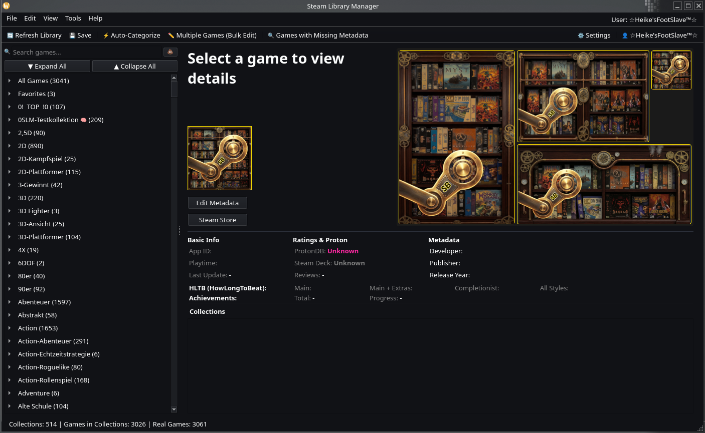
</p>

---

## ☕ HELP! 🙏 Please consider supporting this project!

I wouldn't normally ask, and I'd certainly never beg — but I have to be honest: development has cost me significantly more than expected. API costs, test infrastructure, and hundreds of hours of work add up fast.

If the Steam Library Manager helps you tame your library and you'd like to say thanks — a small tip goes a long way for this project. Any amount, no matter how small, makes a real difference and keeps this project alive.

**You choose the amount** — whether 3 €, 5 €, 10 € (default), or just enter whatever you'd like to give.

<p align="center">
  <a href="https://www.paypal.com/donate/?hosted_button_id=HWPG6YAGXAWJJ">
    
  </a>
</p>

*Thanks to everyone who has already contributed — you're amazing!* 🙏

---

## ✨ Features

---

### 🧠 Smart Collections — *Better Than Steam's Own Dynamic Collections*

Steam has dynamic collections — but they've been **AND-only since launch**. Want games that are *either* "Platinum on ProtonDB" *or* "Native Linux"? Impossible in Steam. You can only narrow down, never combine alternatives.

Our Smart Collections blow past that limitation with full **boolean logic**:

- **AND / OR / NOT** operators with **nested rule groups** — combine as many conditions as you want
- Filter by **playtime ranges**, **review scores**, **Steam Deck compatibility**, **ProtonDB ratings**, **achievement completion**, **HowLongToBeat times**, **tags**, **genres**, and more
- Collections **update themselves** whenever your library data changes
- **Import & Export** collections as JSON — share your setups with friends or back them up

The clever part: In the Steam client, our Smart Collections appear as **regular static collections** — Steam doesn't even know the difference. But in SLM, they're fully dynamic and infinitely more powerful than anything Steam offers.

*Example: "Show me all games rated 'Platinum' on ProtonDB, with more than 20 hours playtime, that I haven't 100%'d yet — but exclude anything tagged 'Visual Novel'."*
One collection. Automatic. Always up to date. **Impossible in Steam.**

<p align="center">
  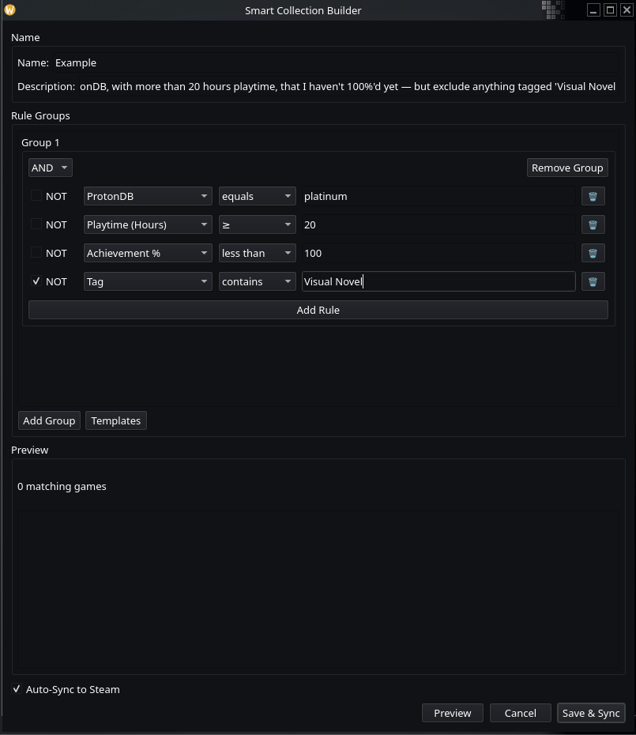
</p>
<p align="center">
  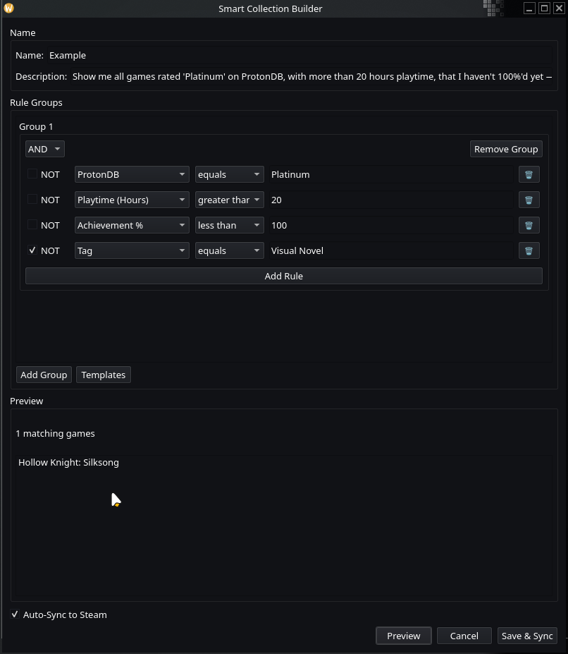
</p>

---

### 🏷️ Auto-Categorization — *16 Rule Types, Infinite Possibilities*

Automatically organize your entire library into meaningful collections with **16 different AutoCat rule types**:

**Tags** · **Genres** · **Publishers** · **Developers** · **Franchises** · **Flags** · **User Score** · **HowLongToBeat** · **Name** · **VR Support** · **Language** · **Curator** · **Platform** · **Hours Played** · **Manual** · **Group**

Each rule type has its own configuration — set thresholds, define ignore lists, choose prefix/suffix patterns, and combine multiple rules into powerful categorization profiles. Smart ignore lists filter out generic tags like "Singleplayer" so your categories stay meaningful.

*Got 500+ games? Hit "Auto-Categorize" and watch them sort themselves into clean, logical collections in seconds.*

<p align="center">
  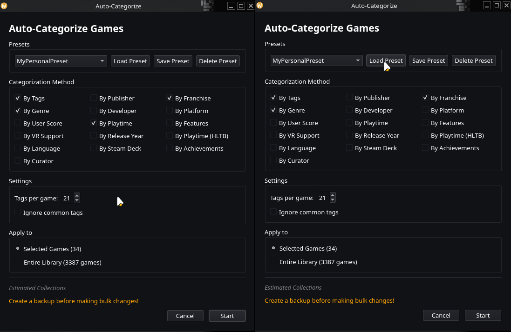
</p>
<p align="center">
  
</p>

---

### ✏️ Metadata Editor — *Your Changes Survive Steam Updates*

Edit game names, sort titles, developers, publishers, and release dates — all stored locally. What makes this special:

- **Overlay System:** Your modifications are stored separately from Steam's data. When Steam overwrites `appinfo.vdf` (which it does regularly), your changes are **automatically re-applied** on top. Like Git rebasing for metadata — Steam provides "upstream", your edits are "patches".
- **Bulk Edit:** Select hundreds of games, change a field, apply. Done.
- **Custom Sort Titles:** Make "The Witcher 3" sort under "W", not "T".

*No other Steam library tool does this. Depressurizer loses your changes when Steam updates. We don't.*

<p align="center">
  
</p>
<p align="center">
  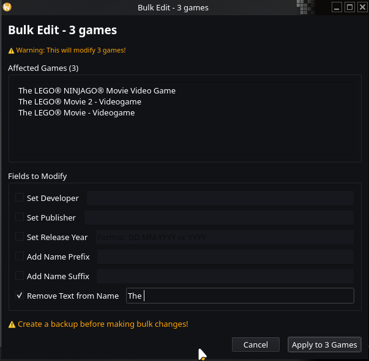
</p>

---

### 🖼️ Artwork Manager — *SteamGridDB at Your Fingertips*

Browse and download **covers, heroes, logos, and icons** from [SteamGridDB](https://www.steamgriddb.com/) — the largest community-driven game artwork database.

- **Visual browser** with thumbnail previews — see what you're picking before you apply it
- **Filter by type:** static, animated (GIF/APNG/WebM), NSFW, humor, epilepsy warning
- **Badge system** with animated slide-down indicators — colored stripes show content tags at a glance
- **One click to apply** — artwork is downloaded and set as your game's cover instantly

<p align="center">
  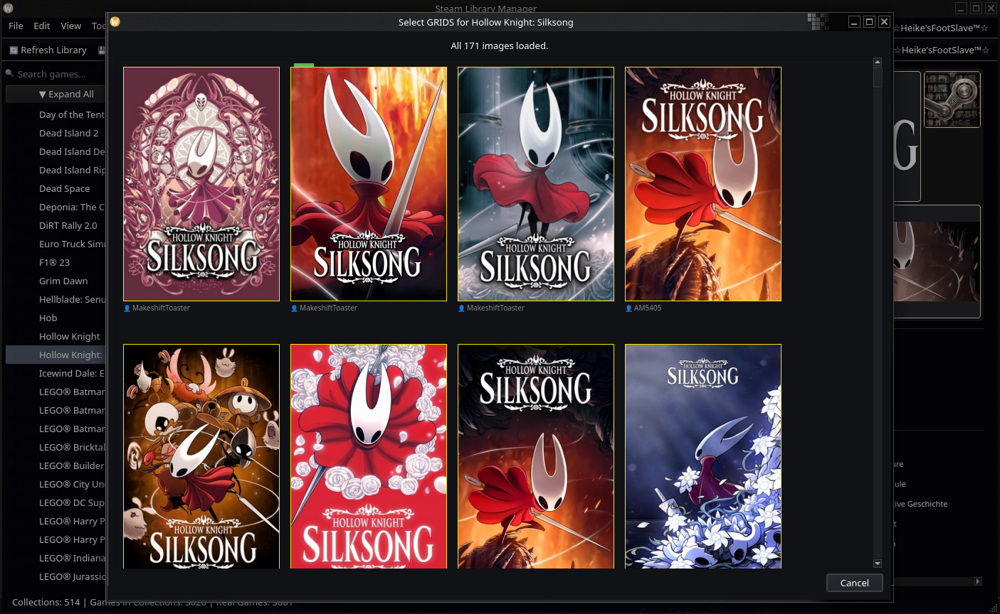
</p>
<p align="center">
  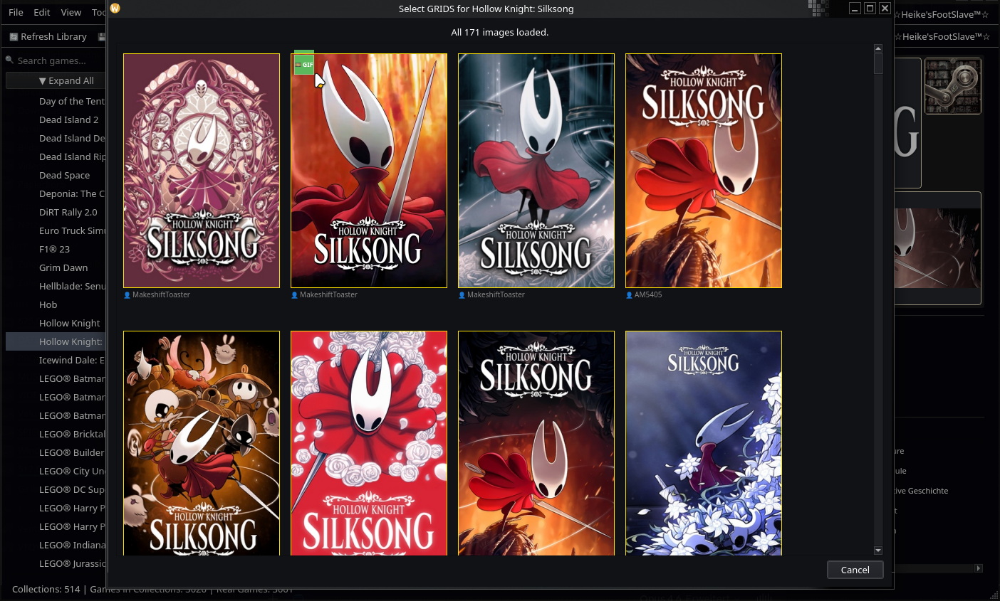
</p>

---

### 📊 Data Enrichment — *Know Everything About Your Games*

Batch-enrich your entire library with data from multiple sources — all cached locally in SQLite for instant access:

| Source | Data | API Key Required? |
|--------|------|:-:|
| **HowLongToBeat** | Main story, completionist, and all playstyles times | No |
| **ProtonDB** | Linux compatibility tier (Platinum/Gold/Silver/Bronze/Borked) | No |
| **Steam Achievements** | Completion percentage per game | No (with OAuth2) |
| **Steam Tags** | Community-voted tags imported directly from Steam | No (with OAuth2) |
| **Steam Store** | Descriptions, DLC info, age ratings | No |

*Hit "Enrich All" and grab a coffee. When you come back, every game in your library has full metadata.*

<p align="center">
  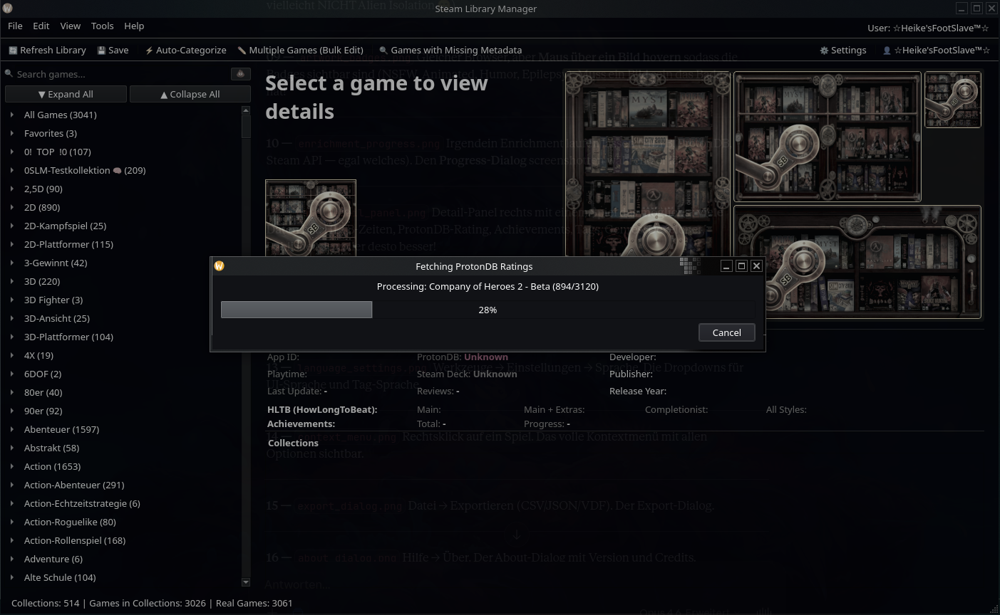
</p>
<p align="center">
  
</p>

---

### 🔒 Secure by Design — *No Copy-Paste, No Plain Text*

- **QR code login** or password login via Steam's official **OAuth2** (`IAuthenticationService`)
- Tokens stored **encrypted** (AES-GCM) with machine-derived keys, or in your **system keyring**
- Automatic **token refresh** — no re-login on every app start
- The **Steam Web API Key** is **optional** thanks to OAuth2 — but adding it is **highly recommended** for full functionality. You can configure it directly in the app under Settings.

*No sketchy browser session tokens. No API keys in plain text config files. Just scan, login, done.*

<p align="center">
  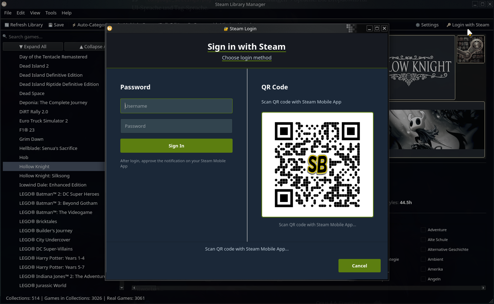
</p>

---

### 🌍 Multilingual — *Your Language, Your Way*

Full **English 🇬🇧** and **German 🇩🇪** interface with **complete i18n** — zero hardcoded strings in the entire codebase.

- **Separate settings** for UI language and tag language — use English UI with German Steam categories, or any combination
- **Localized dates** — "07. Dez 2024" in German, "07 Dec 2024" in English
- **Community translations welcome** — contributing is easy, no coding required ([see below](#-translations))

<p align="center">
  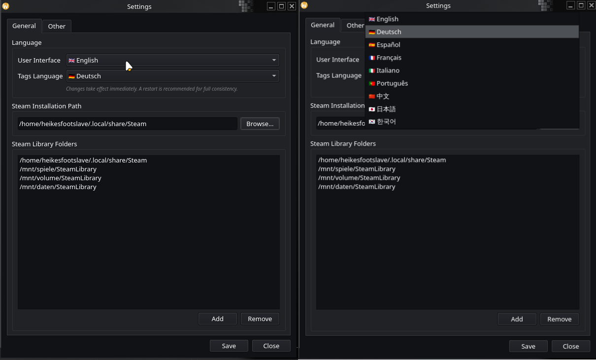
</p>

---

### 🐧 Linux Native — *Built Here, For Here*

Developed with **PyQt6** for seamless desktop integration. This is not a Windows app with a Linux port bolted on — it's **built on Linux, for Linux**, from day one.

- **Steam Deck compatible** — works in Desktop Mode
- **Wayland & X11** supported
- **Flatpak & AppImage** packaging (AUR coming soon)
- Windows support is planned — but Linux always comes first

<p align="center">
  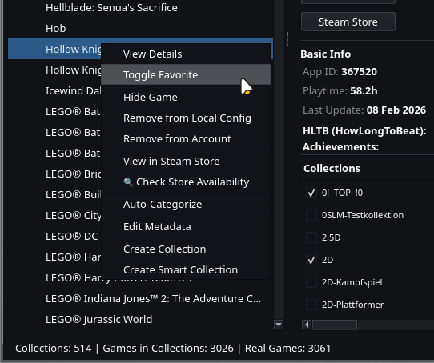
</p>

---

### 🎮 External Games — *One Library to Rule Them All*

Got games scattered across Epic, GOG, Amazon, Lutris, Bottles, itch.io, and Flatpak? **SLM finds them all** — and adds them to Steam as Non-Steam shortcuts in one go.

- **8 platform parsers** — Heroic (Epic/GOG/Amazon), Lutris, Bottles, itch.io, Flatpak, and existing shortcuts.vdf
- **Auto-detection** — SLM scans for installed launchers (native and Flatpak) and reads their game libraries directly. Steam's "Add a Non-Steam Game" dialog only sees executables in your PATH — it has no idea what Heroic, Lutris, or Bottles have installed
- **Duplicate protection** — games already in Steam are detected and skipped
- **Platform collections** — imported games are automatically sorted into Steam collections by platform. In SLM's sidebar, each collection gets a visual emoji indicator for instant recognition:

| Collection | Indicator |
|---|---|
| Epic Games 🟦 | Blue (Epic brand color) |
| GOG Galaxy 🟣 | Purple (GOG brand color) |
| Amazon Games 🟠 | Orange (Amazon brand color) |
| Lutris 🎮 | Controller |
| Bottles 🍾 | Bottle |
| itch.io 🎲 | Dice |
| Flatpak 📦 | Package |

- **Binary VDF parser** — reads and writes Steam's `shortcuts.vdf` format with byte-for-byte accuracy
- **Batch import** — scan all platforms at once, pick what you want, add them all with progress tracking

*Steam's own "Add a Non-Steam Game" dialog can select multiple apps — but it only sees what's in your PATH, not your actual game libraries. SLM scans Heroic, Lutris, Bottles, and more directly, knows exactly what's installed, and organizes everything into clean collections automatically.*

<p align="center">
  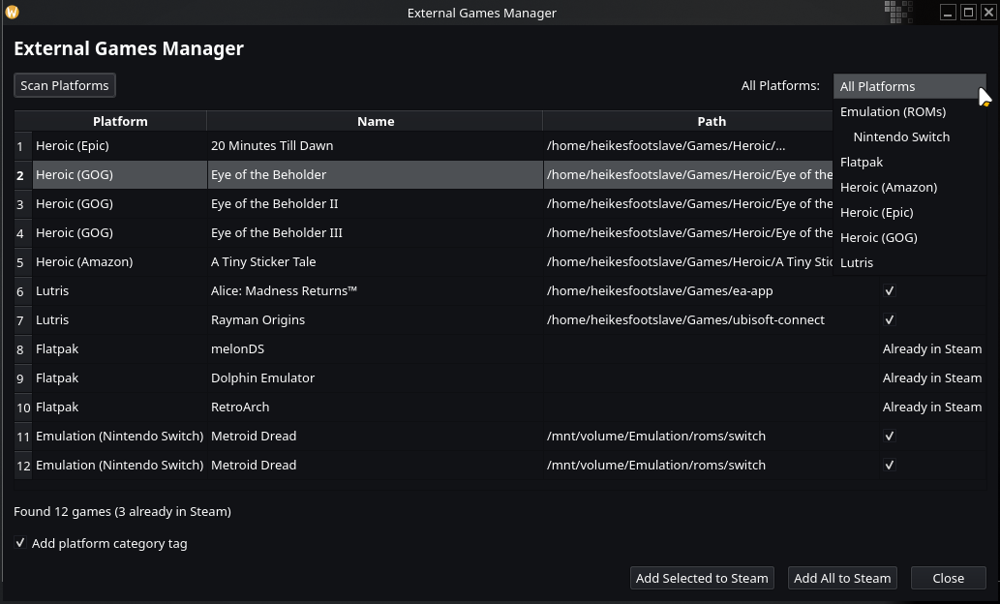
</p>

---

## 📸 Screenshots

<details>
<summary>Click to expand — Full Screenshot Gallery</summary>

| # | Screenshot | Description |
|---|-----------|-------------|
| 01 |  | Main window with game grid and sidebar |
| 02 |  | Smart Collections rule editor |
| 03 |  | Smart Collections filtered results |
| 04 |  | Auto-Categorization configuration |
| 05 |  | Library after auto-categorization |
| 06 |  | Metadata editor for a single game |
| 07 |  | Bulk editing multiple games |
| 08 |  | SteamGridDB artwork browser |
| 09 |  | Artwork badges (NSFW, animated, etc.) |
| 10 |  | Batch enrichment in progress |
| 11 |  | Game detail panel with all data |
| 12 |  | Steam QR code login |
| 13 |  | Language and settings dialog |
| 14 |  | Right-click context menu |
| 15 |  | Export dialog (CSV/JSON/VDF) |
| 16 | 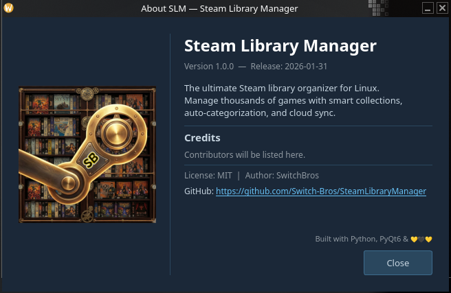 | About dialog |
| 17 |  | External Games Manager — multi-platform import |

</details>

---

## 📦 Download & Install

| Format | Download | Notes |
|--------|----------|-------|
| 🐧 **AppImage** | [Download latest](https://github.com/Switch-Bros/SteamLibraryManager/releases) | Works on any distro — download, chmod +x, run |
| 📦 **Flatpak** | *Coming soon* | Sandboxed, auto-updates |
| 🏗️ **AUR** | *Coming soon* | Arch / Manjaro / CachyOS / EndeavourOS |

<details>
<summary>🔧 Build from source (for developers)</summary>

```bash
# Clone
git clone https://github.com/Switch-Bros/SteamLibraryManager.git
cd SteamLibraryManager

# Virtual environment
python3 -m venv .venv
source .venv/bin/activate

# Dependencies
pip install -r requirements.txt

# Run
python src/main.py
```

Requires **Python 3.10+** and a running **Steam client** (not Big Picture).

</details>

---

<details>
<summary><h2>🔧 API & Authentication Requirements</h2></summary>

This project uses the following services:

### **1. Steam Authentication (OAuth2)**
- **Purpose:** Log in with your Steam account to access your library and display your profile name.
- **How it works:**
  - Uses Steam's official **OAuth2** via `IAuthenticationService` (QR code or password login).
  - Tokens are stored **encrypted** (AES-GCM) or in your system keyring.
  - **Steam Web API Key** is **optional** thanks to OAuth2 — but **highly recommended** for full functionality (metadata enrichment, achievement sync, etc.).
  - You can add your API key directly in the app under **Settings → Steam Web API Key**.
  - Get your key here: [Steam Web API Key](https://steamcommunity.com/dev/apikey)

### **2. SteamGridDB**
- **Required for:** Customizing game covers, heroes, logos, and icons.
- **How to get the API key:**
  - The app **automatically prompts** for the SteamGridDB API key when you click on a game cover for the first time.
  - A window will open where you can:
    1. **Get your API key** from [SteamGridDB](https://www.steamgriddb.com/api).
    2. **Paste the key** into the app's input field.
    3. Click **OK** – the key is saved locally, and covers are ready to use!
  - **Note:** Users must comply with [SteamGridDB's Terms of Service](https://www.steamgriddb.com/terms).

### **3. HowLongToBeat (HLTB)**
- **Included for:** Displaying game completion times and auto-categorization by playtime ranges.
- **No API key required.** Data is fetched automatically and cached locally.
- **Note:** HLTB does not officially provide a public API. Integration respects their [terms](https://howlongtobeat.com/).

### **4. ProtonDB**
- **Included for:** Checking Linux/Proton compatibility ratings for games.
- **No API key required.** Read-only access, cached locally with 7-day TTL.

</details>

---

## 🗺️ Roadmap

| Phase | Status | Description |
|-------|--------|-------------|
| ~~Phase 0–6~~ | ✅ Done | Foundation, Performance, Cloud Sync, Architecture, Depressurizer Parity, Unique Features, Data & External Games |
| **Phase 7** | 🔄 In Progress | Final Hardening, Packaging & Documentation |

---

## 🌍 Translations

Steam Library Manager ships with **English** and **German**. Want to see it in your language?

**Contributing a translation is easy — no coding required!**

1. Copy any JSON file from `resources/i18n/en/` as your template
2. Translate the values (never change the keys!)
3. Keep placeholders like `{count}` and `{name}` untouched
4. Add your language to `resources/i18n/languages.json`:
   ```json
   "fr": "🇫🇷  Français"
   ```
5. Submit a Pull Request

The language name must always be in its **own native script** — "Français", not "French".

---

## 🛡️ Privacy & Security

- **No telemetry.** Steam Library Manager does not phone home.
- **No data collection.** Your library, your data, your machine.
- **Token encryption.** Steam credentials stored using AES-GCM or system keyring.
- **API keys stored locally.** Never transmitted to third parties.
- **Automatic backups.** Before any write to Steam files, a backup is created.

---

## 🤝 Contributing

- 🐛 **Found a bug?** → [Open an Issue](https://github.com/Switch-Bros/SteamLibraryManager/issues)
- 💡 **Have an idea?** → [Start a Discussion](https://github.com/Switch-Bros/SteamLibraryManager/discussions)
- 🌍 **Speak another language?** → [Help translate!](#-translations)
- 🔧 **Want to code?** → Check out [`CLAUDE.md`](CLAUDE.md) for architecture & coding guidelines

---

## 🙏 Acknowledgments

- [SteamGridDB](https://www.steamgriddb.com/) — Game artwork
- [HowLongToBeat](https://howlongtobeat.com/) — Playtime data
- [ProtonDB](https://www.protondb.com/) — Linux compatibility ratings
- [SteamKit2](https://github.com/SteamRE/SteamKit) / [ValvePython/steam](https://github.com/solsticegamestudios/steam) — Steam protocol research
- [steamapi.xpaw.me](https://steamapi.xpaw.me/) — Steam Web API documentation

---

## ⚖️ Legal Notice

This software is provided **"AS IS"**, without warranty of any kind, express or implied, including but not limited to the warranties of merchantability, fitness for a particular purpose, and noninfringement.

In no event shall the authors or copyright holders be liable for any claim, damages, or other liability, whether in an action of contract, tort, or otherwise, arising from, out of, or in connection with the software or the use or other dealings in the software.

- You **must** comply with the terms of service of each API provider (Steam, SteamGridDB, HLTB, ProtonDB).
- The developer (**Switch Bros**) is **not responsible** for misuse of API keys or violations of third-party terms.
- API keys are **stored locally** and **never transmitted** to third parties.
- Steam Library Manager is **not affiliated with, endorsed by, or associated with Valve Corporation** or any other third-party service.

---

## 📜 License

[MIT License](LICENSE) — Copyright © 2026 Switch Bros.

---

<p align="center">
  Made with ❤️ on Linux by <a href="https://github.com/Switch-Bros">Switch Bros</a>
</p>

---

<!-- ================================================================== -->
<!-- GERMAN VERSION -->
<!-- ================================================================== -->

# 🎮 Steam Library Manager *(Deutsch)*

> **Die Depressurizer-Alternative für Linux.**
> Organisiere deine Steam-Bibliothek, kategorisiere Spiele automatisch, bearbeite Metadaten und behalte die Kontrolle über deine Sammlung.

<!-- Deutsche UI Screenshot -->
<p align="center">
  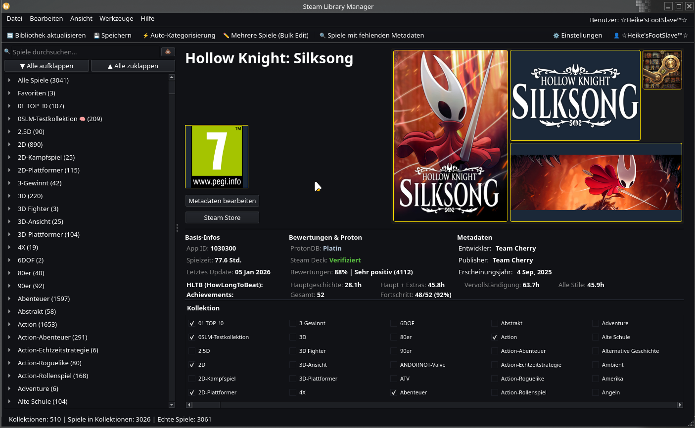
</p>

---

## ☕ HILFE! 🙏 Bitte denk darüber nach dieses Projekt zu unterstützen!

Ich würde normalerweise nie danach fragen, und schon gar nicht darum betteln — aber ich muss ehrlich sein: Die Entwicklung hat mich deutlich mehr gekostet als erwartet. API-Kosten, Test-Infrastruktur und hunderte Stunden Arbeit summieren sich schnell.

Wenn dir der Steam Library Manager hilft deine Bibliothek zu bändigen und du Danke sagen möchtest — ein kleines Trinkgeld hilft diesem Projekt enorm viel. Jeder Betrag, egal wie klein, macht einen echten Unterschied und hält dieses Projekt am Leben.

**Du wählst den Betrag** — ob 3 €, 5 €, 10 € (voreingestellt), oder gib einfach ein was du geben möchtest.

<p align="center">
  <a href="https://www.paypal.com/donate/?hosted_button_id=HWPG6YAGXAWJJ">
    
  </a>
</p>

*Danke an alle die schon etwas gegeben haben — ihr seid großartig!* 🙏

---

## ✨ Features

---

### 🧠 Smart Collections — *Besser als Steams eigene dynamische Kollektionen*

Steam hat dynamische Kollektionen — aber die haben **seit ihrer Einführung nur UND-Logik**. Spiele die *entweder* "Platinum auf ProtonDB" *oder* "Native Linux" sind anzeigen? Geht nicht in Steam. Du kannst nur einschränken, nie Alternativen kombinieren.

Unsere Smart Collections sprengen diese Limitierung mit vollständiger **boolescher Logik**:

- **UND / ODER / NICHT** Operatoren mit **verschachtelten Regelgruppen** — kombiniere beliebig viele Bedingungen
- Filtere nach **Spielzeitbereichen**, **Bewertungen**, **Steam Deck-Kompatibilität**, **ProtonDB-Ratings**, **Achievement-Fortschritt**, **HowLongToBeat-Zeiten**, **Tags**, **Genres** und mehr
- Kollektionen **aktualisieren sich selbst** sobald sich deine Bibliotheksdaten ändern
- **Import & Export** als JSON — teile deine Setups mit Freunden oder sichere sie

Der Clou: Im Steam Client erscheinen unsere Smart Collections als **ganz normale statische Kollektionen** — Steam merkt keinen Unterschied. Aber in SLM sind sie volldynamisch und unendlich mächtiger als alles was Steam bietet.

*Beispiel: "Zeige mir alle Spiele mit 'Platinum' auf ProtonDB, über 20 Stunden Spielzeit, die ich noch nicht zu 100% abgeschlossen habe — aber ohne 'Visual Novels'."*
Eine Kollektion. Automatisch. Immer aktuell. **In Steam unmöglich.**

<p align="center">
  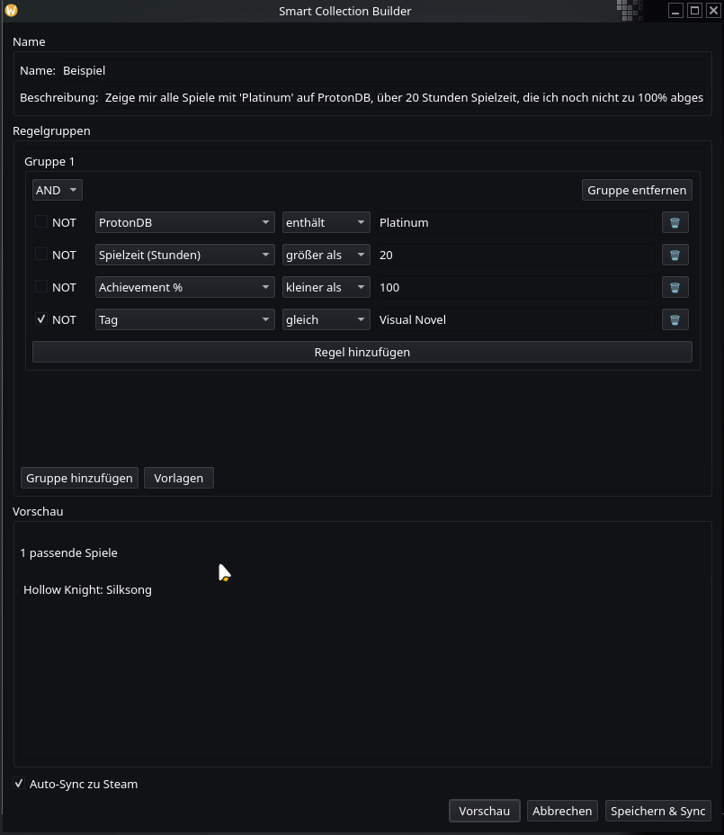
</p>

---

### 🏷️ Auto-Kategorisierung — *16 Regeltypen, unendliche Möglichkeiten*

Organisiere deine gesamte Bibliothek automatisch in sinnvolle Kollektionen mit **16 verschiedenen AutoCat-Regeltypen**:

**Tags** · **Genres** · **Publisher** · **Entwickler** · **Franchises** · **Flags** · **User Score** · **HowLongToBeat** · **Name** · **VR-Unterstützung** · **Sprache** · **Kurator** · **Plattform** · **Spielstunden** · **Manuell** · **Gruppe**

Jeder Regeltyp hat eigene Konfigurationsmöglichkeiten — Schwellenwerte, Ignorier-Listen, Präfix/Suffix-Muster und die Kombination mehrerer Regeln zu leistungsstarken Kategorisierungsprofilen. Intelligente Ignorier-Listen filtern generische Tags wie "Singleplayer" heraus.

*500+ Spiele? Klick auf "Auto-Kategorisieren" und schau zu wie sie sich in Sekunden in saubere, logische Kollektionen sortieren.*

---

### ✏️ Metadaten-Editor — *Deine Änderungen überleben Steam-Updates*

Bearbeite Spielnamen, Sortiertitel, Entwickler, Publisher und Erscheinungsdaten — alles lokal gespeichert. Was das besonders macht:

- **Overlay-System:** Deine Änderungen werden getrennt von Steams Daten gespeichert. Wenn Steam die `appinfo.vdf` überschreibt (was regelmäßig passiert), werden deine Änderungen **automatisch erneut angewendet**. Wie Git-Rebasing für Metadaten — Steam liefert den "Upstream", deine Änderungen sind die "Patches".
- **Bulk-Edit:** Hunderte Spiele auswählen, ein Feld ändern, anwenden. Fertig.
- **Eigene Sortiertitel:** "The Witcher 3" unter "W" einsortieren statt unter "T".

*Kein anderes Steam-Library-Tool kann das. Depressurizer verliert deine Änderungen bei Steam-Updates. Wir nicht.*

<p align="center">
  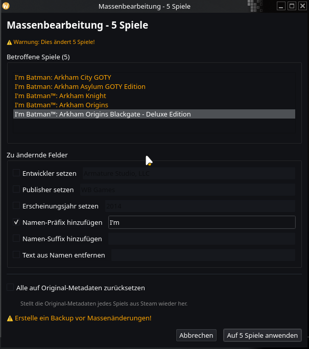
</p>

---

### 🖼️ Artwork-Manager — *SteamGridDB auf Knopfdruck*

Durchsuche und lade **Cover, Heroes, Logos und Icons** von [SteamGridDB](https://www.steamgriddb.com/) herunter — der größten Community-getriebenen Spiele-Artwork-Datenbank.

- **Visueller Browser** mit Vorschaubildern — sieh was du auswählst bevor du es anwendest
- **Filtere nach Typ:** statisch, animiert (GIF/APNG/WebM), NSFW, Humor, Epilepsie-Warnung
- **Badge-System** mit animierten Slide-Down-Indikatoren — farbige Streifen zeigen Inhalts-Tags auf einen Blick
- **Ein Klick zum Anwenden** — Artwork wird heruntergeladen und sofort als Cover gesetzt

---

### 📊 Daten-Anreicherung — *Wisse alles über deine Spiele*

Reichere deine gesamte Bibliothek im Batch mit Daten aus mehreren Quellen an — alles lokal in SQLite gecacht für sofortigen Zugriff:

| Quelle | Daten | API-Key nötig? |
|--------|-------|:-:|
| **HowLongToBeat** | Hauptstory, Komplett, alle Spielstile | Nein |
| **ProtonDB** | Linux-Kompatibilität (Platinum/Gold/Silver/Bronze/Borked) | Nein |
| **Steam Achievements** | Abschlussquote pro Spiel | Nein (mit OAuth2) |
| **Steam Tags** | Community-Tags direkt aus Steam importiert | Nein (mit OAuth2) |
| **Steam Store** | Beschreibungen, DLC-Info, Altersfreigaben | Nein |

*Klick auf "Alle anreichern" und hol dir einen Kaffee. Wenn du zurückkommst hat jedes Spiel vollständige Metadaten.*

<p align="center">
  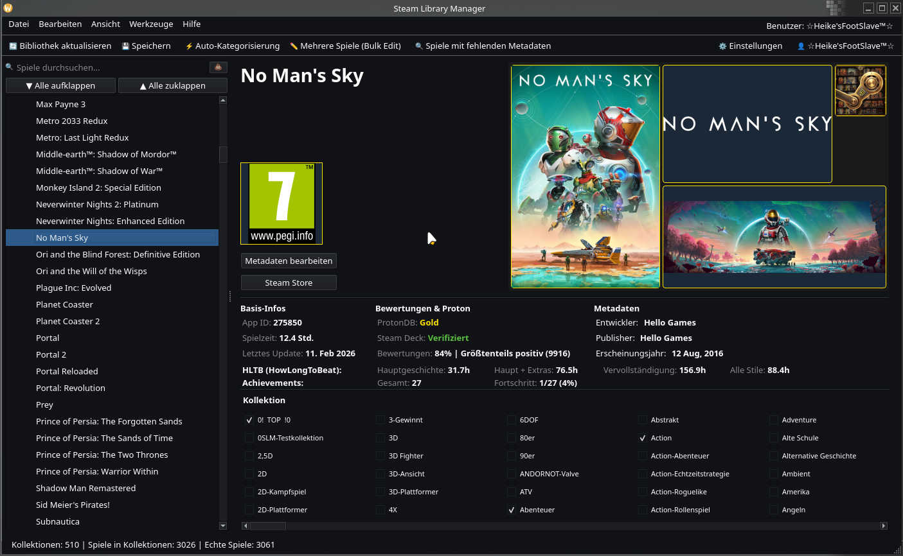
</p>

---

### 🔒 Sicherheit — *Kein Copy-Paste, kein Klartext*

- **QR-Code-Login** oder Passwort-Login über Steams offizielles **OAuth2** (`IAuthenticationService`)
- Tokens **verschlüsselt** (AES-GCM) mit maschinengebundenen Schlüsseln oder im **System-Keyring** gespeichert
- Automatische **Token-Erneuerung** — kein erneutes Anmelden bei jedem App-Start
- Der **Steam Web API Key** ist dank OAuth2 **optional** — wird aber für volle Funktionalität **dringend empfohlen**. Konfiguration direkt in der App unter Einstellungen.

*Keine dubiosen Browser-Session-Tokens. Keine API-Keys in Klartext-Konfigdateien. Einfach scannen, einloggen, fertig.*

---

### 🌍 Mehrsprachig — *Deine Sprache, dein Weg*

Vollständige **Englisch 🇬🇧** und **Deutsch 🇩🇪** Oberfläche mit **kompletter i18n** — null hardcodierte Strings im gesamten Code.

- **Getrennte Einstellungen** für UI-Sprache und Tag-Sprache — englische Oberfläche mit deutschen Steam-Kategorien, oder jede beliebige Kombination
- **Lokalisierte Datumsformate** — "07. Dez 2024" auf Deutsch, "07 Dec 2024" auf Englisch
- **Community-Übersetzungen willkommen** — Beitragen ist einfach, keine Programmierkenntnisse nötig ([siehe unten](#-übersetzungen))

---

### 🐧 Linux Native — *Hier gebaut, für hier gemacht*

Entwickelt mit **PyQt6** für nahtlose Desktop-Integration. Das ist keine Windows-App mit angeschraubtem Linux-Port — es ist **auf Linux gebaut, für Linux**, von Tag eins an.

- **Steam Deck kompatibel** — funktioniert im Desktop-Modus
- **Wayland & X11** unterstützt
- **Flatpak & AppImage** Pakete (AUR kommt bald)
- Windows-Unterstützung ist geplant — aber Linux hat immer Vorrang

<p align="center">
  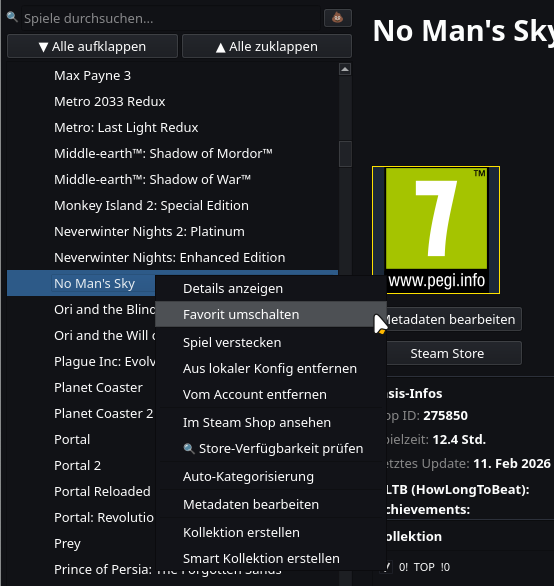
</p>

---

### 🎮 Externe Spiele — *Eine Bibliothek für alles*

Spiele verstreut über Epic, GOG, Amazon, Lutris, Bottles, itch.io und Flatpak? **SLM findet sie alle** — und fügt sie in einem Rutsch als Non-Steam-Shortcuts zu Steam hinzu.

- **8 Plattform-Parser** — Heroic (Epic/GOG/Amazon), Lutris, Bottles, itch.io, Flatpak und bestehende shortcuts.vdf
- **Auto-Erkennung** — SLM scannt nach installierten Launchern (nativ und Flatpak) und liest deren Spielebibliotheken direkt aus. Steams „Steam fremdes Spiel hinzufügen"-Dialog sieht nur Programme in deinem PATH — er hat keine Ahnung was Heroic, Lutris oder Bottles installiert haben
- **Duplikat-Schutz** — bereits in Steam vorhandene Spiele werden erkannt und übersprungen
- **Plattform-Kollektionen** — importierte Spiele werden automatisch nach Plattform in Steam-Kollektionen einsortiert. In SLMs Seitenleiste bekommt jede Kollektion einen visuellen Emoji-Indikator zur sofortigen Erkennung:

| Kollektion | Indikator |
|---|---|
| Epic Games 🟦 | Blau (Epic-Markenfarbe) |
| GOG Galaxy 🟣 | Lila (GOG-Markenfarbe) |
| Amazon Games 🟠 | Orange (Amazon-Markenfarbe) |
| Lutris 🎮 | Controller |
| Bottles 🍾 | Flasche |
| itch.io 🎲 | Würfel |
| Flatpak 📦 | Paket |

- **Binärer VDF-Parser** — liest und schreibt Steams `shortcuts.vdf`-Format mit Byte-genauer Präzision
- **Batch-Import** — alle Plattformen auf einmal scannen, auswählen, alle mit Fortschrittsanzeige hinzufügen

*Steams eigener „Steam fremdes Spiel hinzufügen"-Dialog kann zwar mehrere Apps markieren — aber er sieht nur was in deinem PATH liegt, nicht deine tatsächlichen Spielebibliotheken. SLM scannt Heroic, Lutris, Bottles und mehr direkt, weiß genau was installiert ist, und organisiert alles automatisch in saubere Kollektionen.*

<p align="center">
  
</p>

---

## 📦 Download & Installation

| Format | Download | Hinweise |
|--------|----------|----------|
| 🐧 **AppImage** | [Neueste Version](https://github.com/Switch-Bros/SteamLibraryManager/releases) | Funktioniert auf jeder Distro — herunterladen, chmod +x, starten |
| 📦 **Flatpak** | *Kommt bald* | Sandboxed, Auto-Updates |
| 🏗️ **AUR** | *Kommt bald* | Arch / Manjaro / CachyOS / EndeavourOS |

<details>
<summary>🔧 Aus Quellcode bauen (für Entwickler)</summary>

```bash
# Klonen
git clone https://github.com/Switch-Bros/SteamLibraryManager.git
cd SteamLibraryManager

# Virtuelle Umgebung
python3 -m venv .venv
source .venv/bin/activate

# Abhängigkeiten
pip install -r requirements.txt

# Starten
python src/main.py
```

Benötigt **Python 3.10+** und einen laufenden **Steam Client** (nicht Big Picture).

</details>

---

<details>
<summary><h2>🔧 API- & Authentifizierungs-Anforderungen</h2></summary>

Dieses Projekt nutzt folgende Dienste:

### **1. Steam-Authentifizierung (OAuth2)**
- **Zweck:** Anmeldung mit deinem Steam-Konto für Zugriff auf deine Bibliothek und Anzeige deines Profilnamens.
- **Funktionsweise:**
  - Nutzt Steams offizielles **OAuth2** über `IAuthenticationService` (QR-Code oder Passwort-Login).
  - Tokens werden **verschlüsselt** (AES-GCM) oder im System-Keyring gespeichert.
  - Der **Steam Web API Key** ist dank OAuth2 **optional** — wird aber für volle Funktionalität **dringend empfohlen** (Metadaten-Anreicherung, Achievement-Sync etc.).
  - Du kannst deinen API-Key direkt in der App unter **Einstellungen → Steam Web API Key** eintragen.
  - Key hier beantragen: [Steam Web API Key](https://steamcommunity.com/dev/apikey)

### **2. SteamGridDB**
- **Erforderlich für:** Anpassung von Spiel-Covern, Heroes, Logos und Icons.
- **So erhältst du den API-Schlüssel:**
  - Die App **fragt automatisch** nach dem SteamGridDB-API-Schlüssel, sobald du zum ersten Mal auf ein Spiel-Cover klickst.
  - Es öffnet sich ein Fenster, in dem du:
    1. **Deinen API-Schlüssel** von [SteamGridDB](https://www.steamgriddb.com/api) holst.
    2. **Den Schlüssel** in das Eingabefeld der App einfügst.
    3. Auf **OK** klickst – der Schlüssel wird lokal gespeichert, und die Cover-Funktionen sind sofort nutzbar!
  - **Hinweis:** Nutzer müssen die [Nutzungsbedingungen von SteamGridDB](https://www.steamgriddb.com/terms) einhalten.

### **3. HowLongToBeat (HLTB)**
- **Enthalten für:** Anzeige von Spielzeiten und Auto-Kategorisierung nach Spielzeitbereichen.
- **Kein API-Key nötig.** Daten werden automatisch abgerufen und lokal gecacht.
- **Hinweis:** HLTB bietet keine offizielle öffentliche API an. Die Integration respektiert deren [Nutzungsbedingungen](https://howlongtobeat.com/).

### **4. ProtonDB**
- **Enthalten für:** Linux/Proton-Kompatibilitätsbewertungen.
- **Kein API-Key nötig.** Lesender Zugriff, lokal gecacht mit 7-Tage TTL.

</details>

---

## 🌍 Übersetzungen

Steam Library Manager kommt mit **Englisch** und **Deutsch**. Du willst es in deiner Sprache sehen?

**Eine Übersetzung beizutragen ist einfach — keine Programmierkenntnisse nötig!**

1. Kopiere eine beliebige JSON-Datei aus `resources/i18n/en/` als Vorlage
2. Übersetze die Werte (niemals die Keys ändern!)
3. Platzhalter wie `{count}` und `{name}` unverändert lassen
4. Deine Sprache in `resources/i18n/languages.json` eintragen:
   ```json
   "tr": "🇹🇷  Türkçe"
   ```
5. Pull Request erstellen

Der Sprachname muss immer in der **eigenen Originalschrift** stehen — "Türkçe", nicht "Turkish".

---

## 🛡️ Datenschutz & Sicherheit

- **Keine Telemetrie.** Steam Library Manager telefoniert nicht nach Hause.
- **Keine Datenerfassung.** Deine Bibliothek, deine Daten, dein Rechner.
- **Token-Verschlüsselung.** Steam-Zugangsdaten mit AES-GCM verschlüsselt oder im System-Keyring.
- **API-Keys lokal gespeichert.** Werden niemals an Dritte übermittelt.
- **Automatische Backups.** Vor jedem Schreibvorgang auf Steam-Dateien wird ein Backup erstellt.

---

## ⚖️ Rechtlicher Hinweis

Diese Software wird **„WIE SIE IST"** bereitgestellt, ohne jegliche ausdrückliche oder stillschweigende Gewährleistung, einschließlich, aber nicht beschränkt auf die Gewährleistung der Marktgängigkeit, der Eignung für einen bestimmten Zweck und der Nichtverletzung von Rechten Dritter.

In keinem Fall haften die Autoren oder Urheberrechtsinhaber für Ansprüche, Schäden oder sonstige Haftung, ob aus Vertrag, unerlaubter Handlung oder anderweitig, die sich aus der Software oder der Nutzung der Software oder dem sonstigen Umgang mit der Software ergeben.

- Du **musst** die Nutzungsbedingungen der jeweiligen API-Anbieter (Steam, SteamGridDB, HLTB, ProtonDB) einhalten.
- Der Entwickler (**Switch Bros**) übernimmt **keine Verantwortung** für den Missbrauch von API-Schlüsseln oder Verstöße gegen die Nutzungsbedingungen Dritter.
- API-Schlüssel werden **lokal gespeichert** und **niemals** an Dritte übermittelt.
- Steam Library Manager ist **nicht verbunden mit, unterstützt von oder assoziiert mit Valve Corporation** oder einem anderen Drittanbieter-Dienst.

---

## 📜 Lizenz

[MIT License](LICENSE) — Copyright © 2026 Switch Bros.

---

<p align="center">
  Mit ❤️ auf Linux gebaut von <a href="https://github.com/Switch-Bros">Switch Bros</a>
</p>
