<p align="center">
  <picture>
    <source media="(prefers-color-scheme: dark)" srcset="steam_library_manager/resources/images/readme_header_dark.webp">
    <source media="(prefers-color-scheme: light)" srcset="steam_library_manager/resources/images/readme_header_light.webp">
    
  </picture>
</p>

<h1 align="center">🎮 Steam Library Manager</h1>


[](https://www.python.org/)
[](https://store.steampowered.com/steamdeck)
[](https://github.com/Switch-Bros/SteamLibraryManager/blob/main/LICENSE)
[](https://github.com/Switch-Bros/SteamLibraryManager)
[](https://steamcommunity.com/dev/apikey)
[](https://www.steamgriddb.com/api)
[](https://github.com/Switch-Bros/SteamLibraryManager)
[](https://github.com/Switch-Bros/SteamLibraryManager/releases)

> **The Depressurizer alternative for Linux.**
> Organize your Steam library, auto-categorize games, edit metadata, and take control of your collection — with features Steam doesn't have.

<p align="center">
  <a href="README_DE.md">
    
  </a>
</p>

<!-- Hero Screenshot -->
<p align="center">
  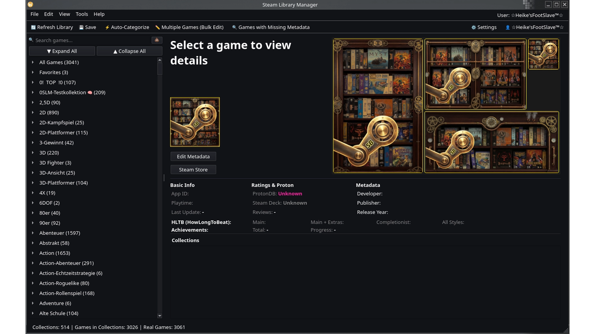
</p>


<h2 align="center">✨ Features</h2>

<p align="center">
  <picture>
    <source media="(prefers-color-scheme: dark)" srcset="steam_library_manager/resources/images/readme_divider_dark.webp">
    <source media="(prefers-color-scheme: light)" srcset="steam_library_manager/resources/images/readme_divider_light.webp">
    
  </picture>
</p>

<h3 align="center">🧠 Smart Collections — <i>A Full Rule Engine That Steam Will Never Have</i></h3>

Steam has dynamic collections — but they've been **AND-only since launch**, with a handful of basic filters. Want games that are *either* "Platinum on ProtonDB" *or* "Native Linux"? Impossible in Steam. You can only narrow down, never combine alternatives.

Our Smart Collections are a **full-blown rule engine** with capabilities Steam will never match:

- **AND / OR / NOT** operators with **nested rule groups** — build complex logic like *(Genre = RPG AND ProtonDB = Platinum) OR (Genre = Strategy AND Deck = Verified)*. Groups let you combine conditions however you want — no limits, no workarounds
- **21 filter fields** across every dimension of your library: playtime, review scores, Steam Deck status, ProtonDB ratings, achievement completion, HowLongToBeat times, tags, genres, release year, developer, publisher, platforms, languages, app type, and more
- **12 operators** including range queries — filter games between 10-50 hours playtime, or review scores above 90%, or tags matching a regex pattern
- **Language-independent tag matching** — switch your Steam tags from English to German (or any language), and your rules keep working. We match by Steam's internal Tag IDs, not by localized names
- **12 ready-made templates** to get started: "Unplayed gems", "100h+ club", "Deck verified", "Quick play (<5h)", "Almost done (75%+ achievements)", and more
- **Live preview** — see matching games update in real-time as you build your rules
- **Import & Export** as JSON — share your setups with friends or back them up

The clever part: In the Steam client, our Smart Collections appear as **regular static collections** — Steam doesn't even know the difference. But in SLM, they're fully dynamic and infinitely more powerful than anything Steam offers.

*Example: "Show me all RPGs rated 'Platinum' on ProtonDB with more than 20 hours playtime that I haven't 100%'d yet — OR any Strategy game verified for Steam Deck — but exclude anything tagged 'Visual Novel'."*
One collection. Two rule groups. Automatic. Always up to date. **Impossible in Steam.**

<p align="center">
  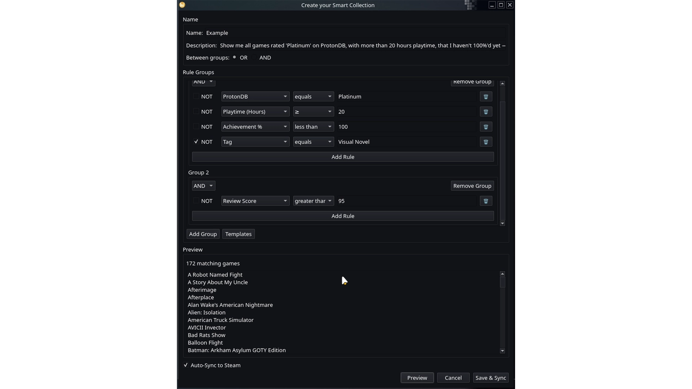
</p>

<p align="center">
  <picture>
    <source media="(prefers-color-scheme: dark)" srcset="steam_library_manager/resources/images/readme_divider_dark.webp">
    <source media="(prefers-color-scheme: light)" srcset="steam_library_manager/resources/images/readme_divider_light.webp">
    
  </picture>
</p>

<h3 align="center">💛 Support This Project</h3>

If SLM saves you time organizing your library, consider supporting its development. Every contribution — no matter how small — helps keep this project alive and growing.

<p align="center">
  <a href="https://www.paypal.com/donate/?hosted_button_id=HWPG6YAGXAWJJ">
    
  </a>
  &nbsp;&nbsp;&nbsp;&nbsp;&nbsp;
  <a href="https://ko-fi.com/S6S51T9G3Y">
    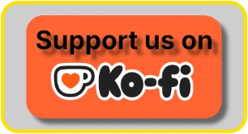
  </a>
</p>

<p align="center"><i>Thank you to everyone who has already contributed — you're amazing! 🙏</i></p>

<p align="center">
  <picture>
    <source media="(prefers-color-scheme: dark)" srcset="steam_library_manager/resources/images/readme_divider_dark.webp">
    <source media="(prefers-color-scheme: light)" srcset="steam_library_manager/resources/images/readme_divider_light.webp">
    
  </picture>
</p>

<h3 align="center">🏷️ Auto-Categorization — <i>17 Rule Types, Infinite Possibilities</i></h3>

Automatically organize your entire library into meaningful collections with **17 different AutoCat rule types**:

**Tags** · **Genres** · **Publishers** · **Developers** · **Franchises** · **Flags** · **User Score** · **HowLongToBeat** · **Year** · **VR Support** · **Language** · **Curator** · **Platform** · **Hours Played** · **Deck Status** · **Achievements** · **PEGI Rating**

Each rule type has its own configuration — set thresholds, define ignore lists, choose prefix/suffix patterns, and combine multiple rules into powerful categorization profiles. Smart ignore lists filter out generic tags like "Singleplayer" so your categories stay meaningful.

*Got 500+ games? Hit "Auto-Categorize" and watch them sort themselves into clean, logical collections in seconds.*

<p align="center">
  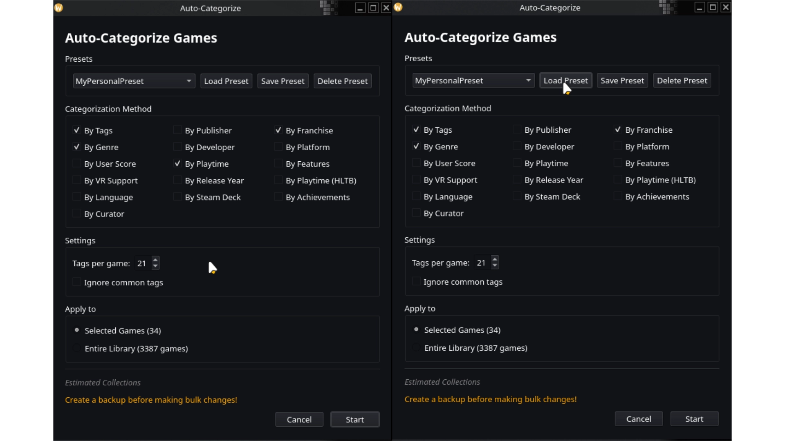
</p>
<p align="center">
  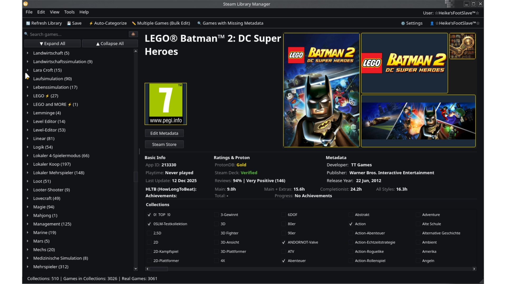
</p>

<p align="center">
  <picture>
    <source media="(prefers-color-scheme: dark)" srcset="steam_library_manager/resources/images/readme_divider_dark.webp">
    <source media="(prefers-color-scheme: light)" srcset="steam_library_manager/resources/images/readme_divider_light.webp">
    
  </picture>
</p>

<h3 align="center">✏️ Metadata Editor — <i>Your Changes Survive Steam Updates</i></h3>

Edit game names, sort titles, developers, publishers, and release dates — all stored locally. What makes this special:

- **Overlay System:** Your modifications are stored separately from Steam's data. When Steam overwrites `appinfo.vdf` (which it does regularly), your changes are **automatically re-applied** on top. Like Git rebasing for metadata — Steam provides "upstream", your edits are "patches".
- **Bulk Edit:** Select hundreds of games, change a field, apply. Done.
- **Custom Sort Titles:** Make "The Witcher 3" sort under "W", not "T".

*No other Steam library tool does this. Depressurizer loses your changes when Steam updates. We don't.*

<p align="center">
  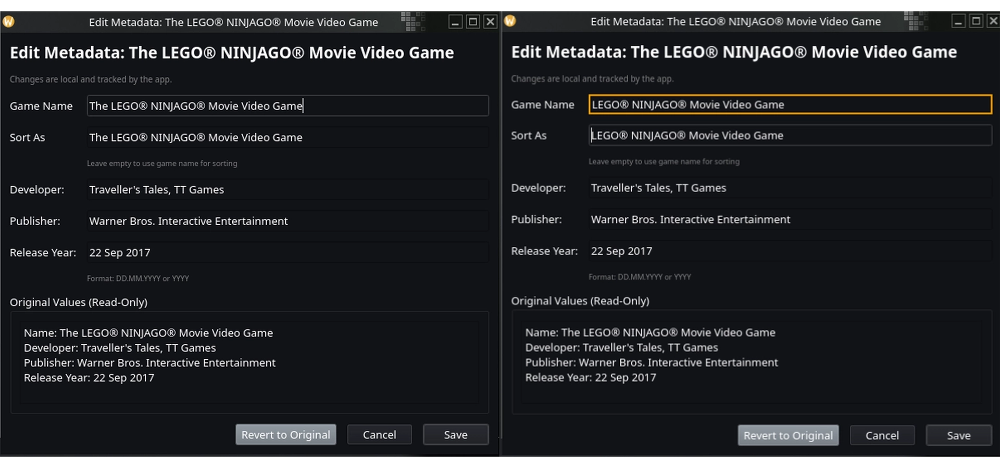
</p>
<p align="center">
  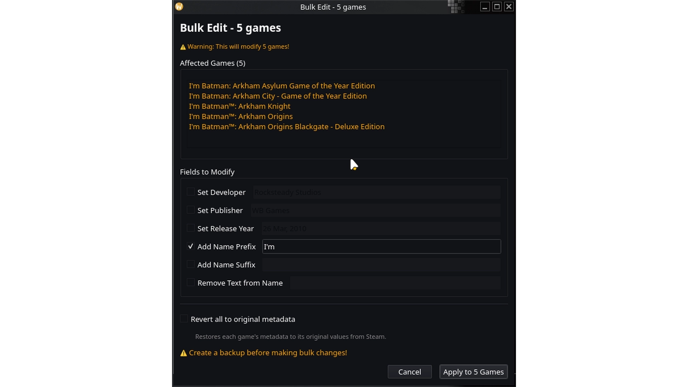
</p>

<p align="center">
  <picture>
    <source media="(prefers-color-scheme: dark)" srcset="steam_library_manager/resources/images/readme_divider_dark.webp">
    <source media="(prefers-color-scheme: light)" srcset="steam_library_manager/resources/images/readme_divider_light.webp">
    
  </picture>
</p>

<h3 align="center">🖼️ Artwork Manager — <i>SteamGridDB at Your Fingertips</i></h3>

Browse and download **covers, heroes, logos, and icons** from [SteamGridDB](https://www.steamgriddb.com/) — the largest community-driven game artwork database.

- **Visual browser** with thumbnail previews — see what you're picking before you apply it
- **Filter by type:** static, animated (GIF/APNG/WebM), NSFW, humor, epilepsy warning
- **Badge system** with animated slide-down indicators — colored stripes show content tags at a glance
- **One click to apply** — artwork is downloaded and set as your game's cover instantly

<p align="center">
  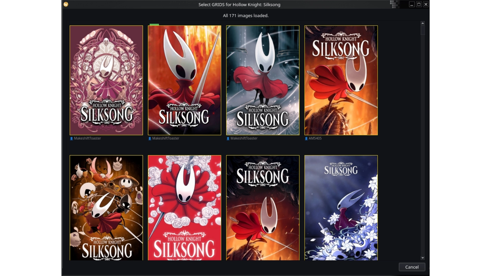
</p>
<p align="center">
  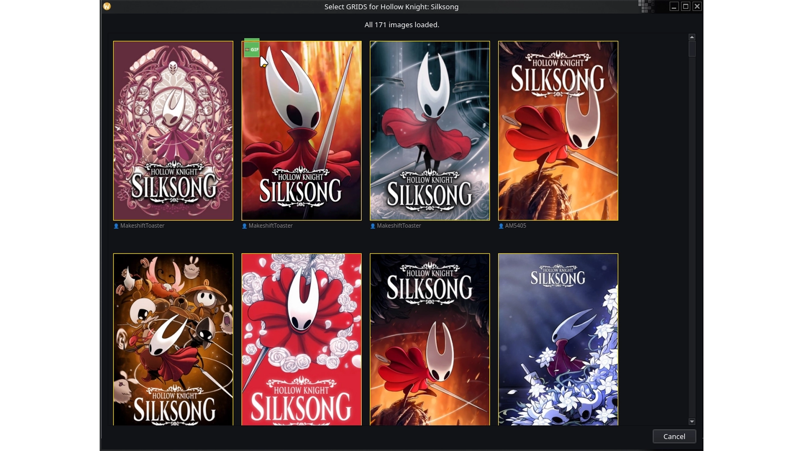
</p>

<p align="center">
  <picture>
    <source media="(prefers-color-scheme: dark)" srcset="steam_library_manager/resources/images/readme_divider_dark.webp">
    <source media="(prefers-color-scheme: light)" srcset="steam_library_manager/resources/images/readme_divider_light.webp">
    
  </picture>
</p>

<h3 align="center">📊 Data Enrichment — <i>Know Everything About Your Games</i></h3>

Batch-enrich your entire library with data from multiple sources — all cached locally in SQLite for instant access:

| Source | Data | API Key Required? |
|--------|------|:-:|
| **HowLongToBeat** | Main story, completionist, and all playstyles times | No |
| **ProtonDB** | Linux compatibility tier (Platinum/Gold/Silver/Bronze/Borked) | No |
| **Steam Achievements** | Completion percentage per game | No (with OAuth2) |
| **Steam Tags** | Community-voted tags imported directly from Steam | No (with OAuth2) |
| **Steam Store** | Descriptions, DLC info, age ratings | No |

*Hit "Enrich All" and grab a coffee. When you come back, every game in your library has full metadata.*

<p align="center">
  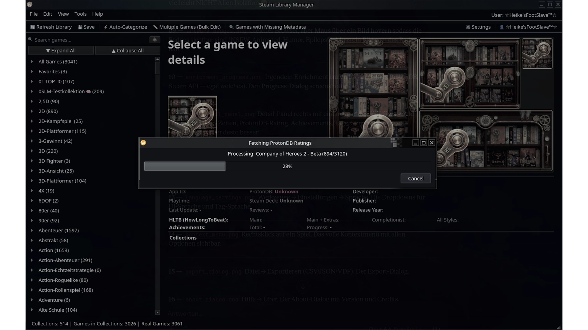
</p>
<p align="center">
  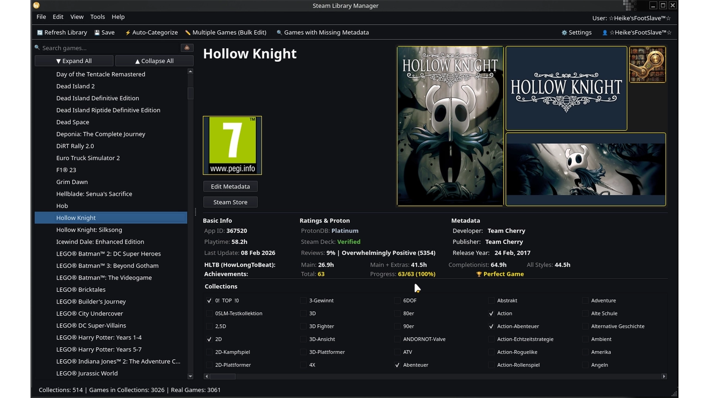
</p>

<p align="center">
  <picture>
    <source media="(prefers-color-scheme: dark)" srcset="steam_library_manager/resources/images/readme_divider_dark.webp">
    <source media="(prefers-color-scheme: light)" srcset="steam_library_manager/resources/images/readme_divider_light.webp">
    
  </picture>
</p>

<h3 align="center">🔒 Secure by Design — <i>No Copy-Paste, No Plain Text</i></h3>

- **QR code login** or password login via Steam's official **OAuth2** (`IAuthenticationService`)
- Tokens stored **encrypted** (AES-GCM) with machine-derived keys, or in your **system keyring**
- Automatic **token refresh** — no re-login on every app start
- The **Steam Web API Key** is **optional** thanks to OAuth2 — but adding it is **highly recommended** for full functionality. You can configure it directly in the app under Settings.

*No sketchy browser session tokens. No API keys in plain text config files. Just scan, login, done.*

<p align="center">
  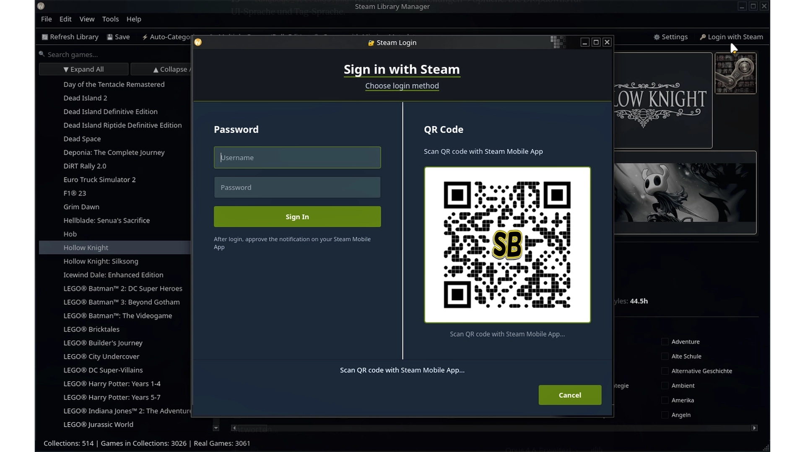
</p>

<p align="center">
  <picture>
    <source media="(prefers-color-scheme: dark)" srcset="steam_library_manager/resources/images/readme_divider_dark.webp">
    <source media="(prefers-color-scheme: light)" srcset="steam_library_manager/resources/images/readme_divider_light.webp">
    
  </picture>
</p>

<h3 align="center">🌍 Multilingual — <i>Your Language, Your Way</i></h3>

Full **English 🇬🇧** and **German 🇩🇪** interface with **complete i18n** — zero hardcoded strings in the entire codebase.

- **Separate settings** for UI language and tag language — use English UI with German Steam categories, or any combination
- **Localized dates** — "07. Dez 2024" in German, "07 Dec 2024" in English
- **Community translations welcome** — contributing is easy, no coding required ([see below](#-translations))

<p align="center">
  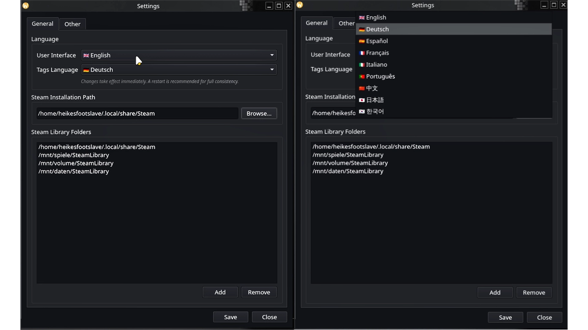
</p>

<p align="center">
  <picture>
    <source media="(prefers-color-scheme: dark)" srcset="steam_library_manager/resources/images/readme_divider_dark.webp">
    <source media="(prefers-color-scheme: light)" srcset="steam_library_manager/resources/images/readme_divider_light.webp">
    
  </picture>
</p>

<h3 align="center">🐧 Linux Native — <i>Built Here, For Here</i></h3>

Developed with **PyQt6** for seamless desktop integration. This is not a Windows app with a Linux port bolted on — it's **built on Linux, for Linux**, from day one.

- **Steam Deck compatible** — works in Desktop Mode
- **Wayland & X11** supported
- **AppImage, Flatpak & AUR** packaging available
- Windows support is planned — but Linux always comes first

<p align="center">
  <picture>
    <source media="(prefers-color-scheme: dark)" srcset="steam_library_manager/resources/images/readme_divider_dark.webp">
    <source media="(prefers-color-scheme: light)" srcset="steam_library_manager/resources/images/readme_divider_light.webp">
    
  </picture>
</p>

<h3 align="center">🎮 External Games — <i>One Library to Rule Them All</i></h3>

Got games scattered across Epic, GOG, Amazon, Lutris, Bottles, itch.io, and Flatpak? **SLM finds them all** — and adds them to Steam as Non-Steam shortcuts in one go.

- **8 platform parsers** — Heroic (Epic/GOG/Amazon), Lutris, Bottles, itch.io, Flatpak, and existing shortcuts.vdf
- **Auto-detection** — SLM scans for installed launchers (native and Flatpak) and reads their game libraries directly. Steam's "Add a Non-Steam Game" dialog only sees executables in your PATH — it has no idea what Heroic, Lutris, or Bottles have installed
- **Duplicate protection** — games already in Steam are detected and skipped
- **Platform collections** — imported games are automatically sorted into Steam collections by platform. In SLM's sidebar, each collection gets a visual emoji indicator for instant recognition:

| Collection | Indicator |
|---|---|
| Epic Games 🟦 | Blue (Epic brand color) |
| GOG Galaxy 🟣 | Purple (GOG brand color) |
| Amazon Games 🟠 | Orange (Amazon brand color) |
| Lutris 🎮 | Controller |
| Bottles 🍾 | Bottle |
| itch.io 🎲 | Dice |
| Flatpak 📦 | Package |

- **Binary VDF parser** — reads and writes Steam's `shortcuts.vdf` format with byte-for-byte accuracy
- **Batch import** — scan all platforms at once, pick what you want, add them all with progress tracking

*Steam's own "Add a Non-Steam Game" dialog can select multiple apps — but it only sees what's in your PATH, not your actual game libraries. SLM scans Heroic, Lutris, Bottles, and more directly, knows exactly what's installed, and organizes everything into clean collections automatically.*

<p align="center">
  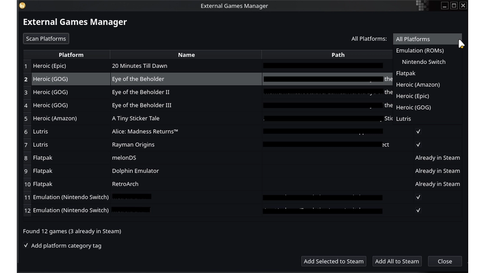
</p>


<h2 align="center">📸 More Screenshots</h2>

<details>
<summary>Click to expand — Additional Views</summary>

| Screenshot | Description |
|-----------|-------------|
| 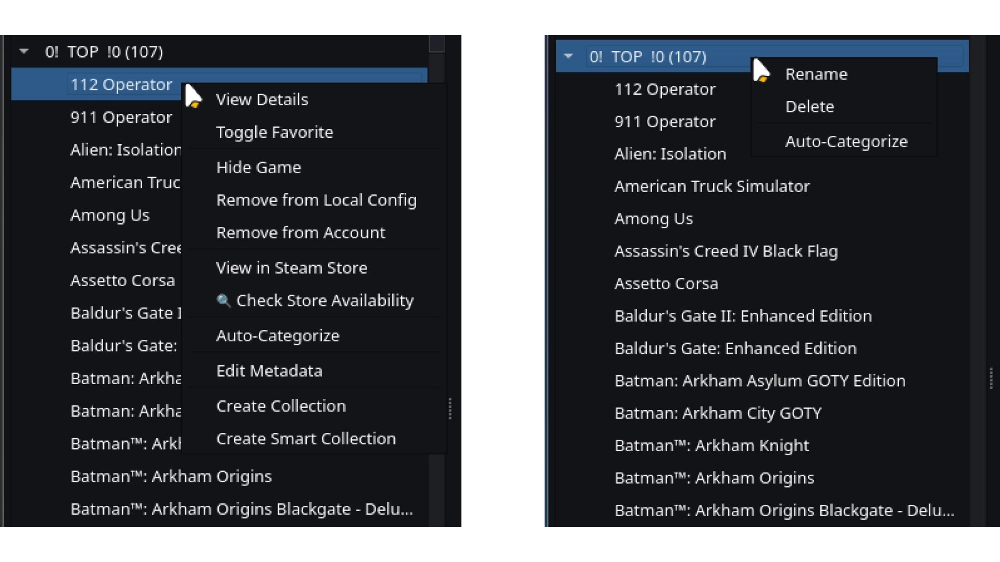 | Right-click context menu — quick access to all actions |
| 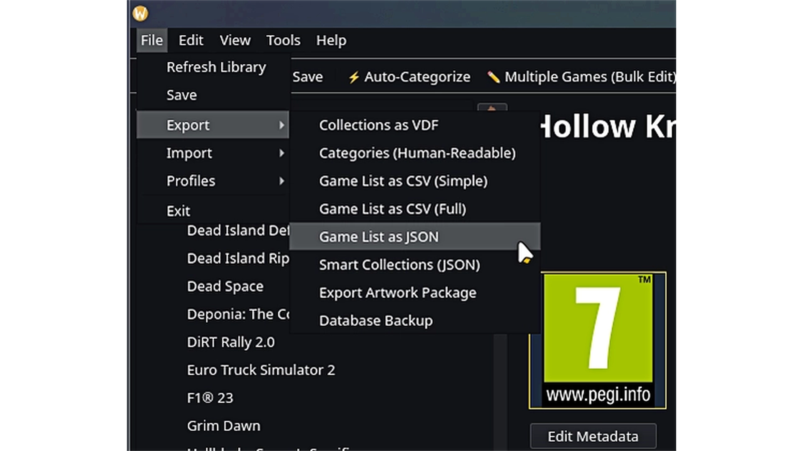 | Export dialog — CSV, JSON, VDF, Database Backup |
| 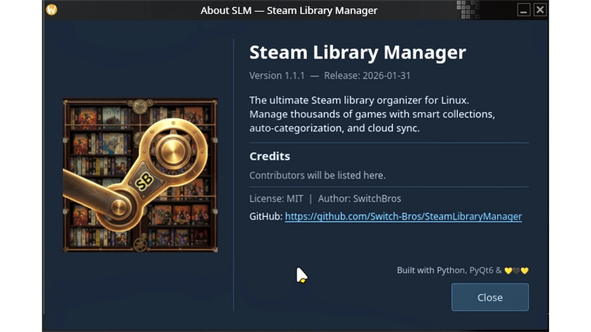 | About dialog with version & system info |

</details>


<h2 align="center">📦 Download & Install</h2>

| Format | Download | Notes |
|--------|----------|-------|
| 🐧 **AppImage** | [Download latest](https://github.com/Switch-Bros/SteamLibraryManager/releases) | Works on any distro — download, chmod +x, run |
| 📦 **Flatpak** | *Pending Flathub review* | Sandboxed, auto-updates |
| 🏗️ **AUR** | `yay -S steam-library-manager` | Arch / Manjaro / CachyOS / EndeavourOS |

<details>
<summary>🔧 Build from source (for developers)</summary>

```bash
# Clone
git clone https://github.com/Switch-Bros/SteamLibraryManager.git
cd SteamLibraryManager

# Virtual environment
python3 -m venv .venv
source .venv/bin/activate

# Dependencies
pip install -r requirements.txt

# Run
python steam_library_manager/main.py
```

Requires **Python 3.10+** and a running **Steam client** (not Big Picture).

</details>

<p align="center">
  <picture>
    <source media="(prefers-color-scheme: dark)" srcset="steam_library_manager/resources/images/readme_divider_dark.webp">
    <source media="(prefers-color-scheme: light)" srcset="steam_library_manager/resources/images/readme_divider_light.webp">
    
  </picture>
</p>

<details>
<summary><h2>🔧 API & Authentication Requirements</h2></summary>

This project uses the following services:

<h3 align="center">1. Steam Authentication (OAuth2)</h3>
- **Purpose:** Log in with your Steam account to access your library and display your profile name.
- **How it works:**
  - Uses Steam's official **OAuth2** via `IAuthenticationService` (QR code or password login).
  - Tokens are stored **encrypted** (AES-GCM) or in your system keyring.
  - **Steam Web API Key** is **optional** thanks to OAuth2 — but **highly recommended** for full functionality (metadata enrichment, achievement sync, etc.).
  - You can add your API key directly in the app under **Settings → Steam Web API Key**.
  - Get your key here: [Steam Web API Key](https://steamcommunity.com/dev/apikey)

<h3 align="center">2. SteamGridDB</h3>
- **Required for:** Customizing game covers, heroes, logos, and icons.
- **How to get the API key:**
  - The app **automatically prompts** for the SteamGridDB API key when you click on a game cover for the first time.
  - A window will open where you can:
    1. **Get your API key** from [SteamGridDB](https://www.steamgriddb.com/api).
    2. **Paste the key** into the app's input field.
    3. Click **OK** – the key is saved locally, and covers are ready to use!
  - **Note:** Users must comply with [SteamGridDB's Terms of Service](https://www.steamgriddb.com/terms).

<h3 align="center">3. HowLongToBeat (HLTB)</h3>
- **Included for:** Displaying game completion times and auto-categorization by playtime ranges.
- **No API key required.** Data is fetched automatically and cached locally.
- **Note:** HLTB does not officially provide a public API. Integration respects their [terms](https://howlongtobeat.com/).

<h3 align="center">4. ProtonDB</h3>
- **Included for:** Checking Linux/Proton compatibility ratings for games.
- **No API key required.** Read-only access, cached locally with 7-day TTL.

</details>


<h2 align="center">🗺️ Roadmap</h2>

| Milestone | Status |
|-----------|--------|
| Core engine, database, cloud sync, auth | ✅ Complete |
| Architecture refactoring, menu redesign | ✅ Complete |
| Depressurizer feature parity (17 AutoCat types) | ✅ Complete |
| Smart Collections, Steam Deck Optimizer, HLTB | ✅ Complete |
| External Games (8 parsers), ProtonDB, Curators | ✅ Complete |
| UI polish, keyboard shortcuts, documentation | ✅ Complete |
| **v1.1.1 — First public release** | ✅ **Released** |
| Packaging (AppImage, AUR, Flatpak) | 🔄 Flatpak pending review |
| Windows support | 📋 Planned |


<h2 align="center">🌍 Translations</h2>

Steam Library Manager ships with **English** and **German**. Want to see it in your language?

**Contributing a translation is easy — no coding required!**

1. Copy any JSON file from `steam_library_manager/resources/i18n/en/` as your template
2. Translate the values (never change the keys!)
3. Keep placeholders like `{count}` and `{name}` untouched
4. Add your language to `steam_library_manager/resources/i18n/languages.json`:
   ```json
   "fr": "🇫🇷  Français"
   ```
5. Submit a Pull Request

The language name must always be in its **own native script** — "Français", not "French".


<h2 align="center">🛡️ Privacy & Security</h2>

- **No telemetry.** Steam Library Manager does not phone home.
- **No data collection.** Your library, your data, your machine.
- **Token encryption.** Steam credentials stored using AES-GCM or system keyring.
- **API keys stored locally.** Never transmitted to third parties.
- **Automatic backups.** Before any write to Steam files, a backup is created.


<h2 align="center">🤝 Contributing</h2>

- 🐛 **Found a bug?** → [Open an Issue](https://github.com/Switch-Bros/SteamLibraryManager/issues)
- 💡 **Have an idea?** → [Start a Discussion](https://github.com/Switch-Bros/SteamLibraryManager/discussions)
- 🌍 **Speak another language?** → [Help translate!](#-translations)
- 🔧 **Want to code?** → Check out [`CLAUDE.md`](CLAUDE.md) for architecture & coding guidelines


<h2 align="center">🙏 Acknowledgments</h2>

- [SteamGridDB](https://www.steamgriddb.com/) — Game artwork
- [HowLongToBeat](https://howlongtobeat.com/) — Playtime data
- [ProtonDB](https://www.protondb.com/) — Linux compatibility ratings
- [SteamKit2](https://github.com/SteamRE/SteamKit) / [ValvePython/steam](https://github.com/solsticegamestudios/steam) — Steam protocol research
- [steamapi.xpaw.me](https://steamapi.xpaw.me/) — Steam Web API documentation


<h2 align="center">⚖️ Legal Notice</h2>

This software is provided **"AS IS"**, without warranty of any kind, express or implied, including but not limited to the warranties of merchantability, fitness for a particular purpose, and noninfringement.

In no event shall the authors or copyright holders be liable for any claim, damages, or other liability, whether in an action of contract, tort, or otherwise, arising from, out of, or in connection with the software or the use or other dealings in the software.

- You **must** comply with the terms of service of each API provider (Steam, SteamGridDB, HLTB, ProtonDB).
- The developer (**Switch Bros**) is **not responsible** for misuse of API keys or violations of third-party terms.
- API keys are **stored locally** and **never transmitted** to third parties.
- Steam Library Manager is **not affiliated with, endorsed by, or associated with Valve Corporation** or any other third-party service.


<h2 align="center">📜 License</h2>

[MIT License](LICENSE) — Copyright © 2026 Switch Bros.

<p align="center">
  <picture>
    <source media="(prefers-color-scheme: dark)" srcset="steam_library_manager/resources/images/readme_footer_dark.webp">
    <source media="(prefers-color-scheme: light)" srcset="steam_library_manager/resources/images/readme_footer_light.webp">
    
  </picture>
</p>

<p align="center">
  Made with ❤️ on Linux by <a href="https://github.com/Switch-Bros">Switch Bros</a>
</p>
