<p align="center">
  <picture>
    <source media="(prefers-color-scheme: dark)" srcset="steam_library_manager/resources/images/readme_header_dark.webp">
    <source media="(prefers-color-scheme: light)" srcset="steam_library_manager/resources/images/readme_header_light.webp">
    
  </picture>
</p>

<h1 align="center">🎮 Steam Library Manager</h1>


[](https://www.python.org/)
[](https://store.steampowered.com/steamdeck)
[](https://github.com/Switch-Bros/SteamLibraryManager/blob/main/LICENSE)
[](https://github.com/Switch-Bros/SteamLibraryManager)
[](https://steamcommunity.com/dev/apikey)
[](https://www.steamgriddb.com/api)
[](https://github.com/Switch-Bros/SteamLibraryManager)
[](https://github.com/Switch-Bros/SteamLibraryManager/releases)

> **Die Depressurizer-Alternative für Linux.**
> Organisiere deine Steam-Bibliothek, kategorisiere Spiele automatisch, bearbeite Metadaten und behalte die Kontrolle über deine Sammlung - mit Features, die Steam nicht hat.

<p align="center">
  <a href="README.md">
    
  </a>
</p>

<!-- Hero Screenshot -->
<p align="center">
  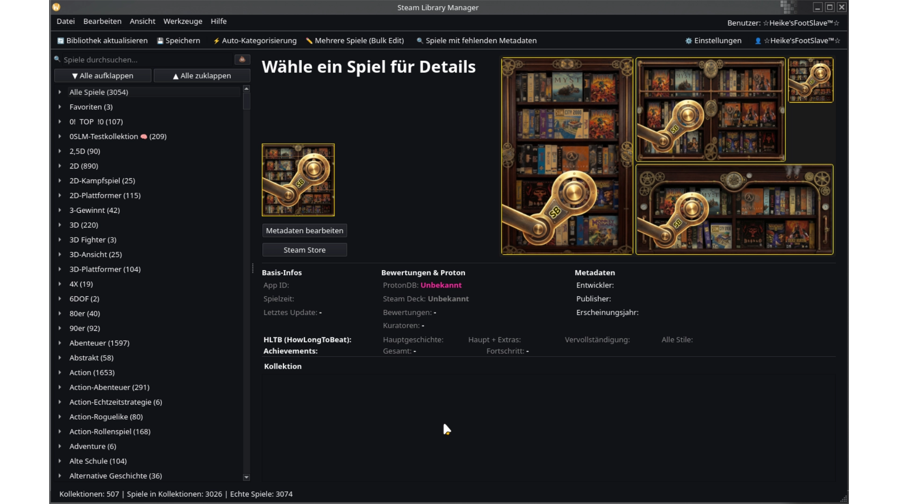
</p>


<h2 align="center">✨ Features</h2>

<p align="center">
  <picture>
    <source media="(prefers-color-scheme: dark)" srcset="steam_library_manager/resources/images/readme_divider_dark.webp">
    <source media="(prefers-color-scheme: light)" srcset="steam_library_manager/resources/images/readme_divider_light.webp">
    
  </picture>
</p>

<h3 align="center">🧠 Smart Collections - <i>Eine vollwertige Rule Engine, die Steam nie haben wird</i></h3>

Steam hat dynamische Kollektionen - aber die haben **seit ihrer Einführung nur UND-Logik** mit einer Handvoll einfacher Filter. Spiele die *entweder* "Platinum auf ProtonDB" *oder* "Native Linux" sind anzeigen? Geht nicht in Steam. Du kannst nur einschränken, nie Alternativen kombinieren.

Unsere Smart Collections sind eine **vollwertige Rule Engine** mit Möglichkeiten, die Steam nie haben wird:

- **UND / ODER / NICHT** Operatoren mit **verschachtelten Regelgruppen** - baue komplexe Logik wie *(Genre = RPG UND ProtonDB = Platinum) ODER (Genre = Strategie UND Deck = Verified)*. Gruppen erlauben beliebige Kombinationen - keine Limits, keine Workarounds
- **21 Filterfelder** über jede Dimension deiner Bibliothek: Spielzeit, Bewertungen, Steam Deck-Status, ProtonDB-Ratings, Achievement-Fortschritt, HowLongToBeat-Zeiten, Tags, Genres, Erscheinungsjahr, Entwickler, Publisher, Plattformen, Sprachen, App-Typ und mehr
- **12 Operatoren** inklusive Bereichsabfragen - filtere Spiele zwischen 10-50 Stunden Spielzeit, oder Bewertungen über 90%, oder Tags die einem Regex-Muster entsprechen
- **Sprachunabhängiges Tag-Matching** - wechsle deine Steam-Tags von Deutsch auf Englisch (oder jede andere Sprache), und deine Regeln funktionieren weiterhin. Wir matchen über Steams interne Tag-IDs, nicht über lokalisierte Namen
- **12 fertige Vorlagen** zum Sofort-Loslegen: "Ungespielt", "100h+ Club", "Deck Verified", "Kurz (<5h)", "Fast geschafft (75%+ Achievements)" und mehr
- **Live-Vorschau** - sieh passende Spiele in Echtzeit während du Regeln baust
- **Import & Export** als JSON - teile deine Setups mit Freunden oder sichere sie

Der Clou: Im Steam Client erscheinen unsere Smart Collections als **ganz normale statische Kollektionen** - Steam merkt keinen Unterschied. Aber in SLM sind sie volldynamisch und unendlich mächtiger als alles was Steam bietet.

*Beispiel: "Zeige mir alle RPGs mit 'Platinum' auf ProtonDB und über 20 Stunden Spielzeit, die ich noch nicht zu 100% abgeschlossen habe - ODER jedes Strategiespiel das für Steam Deck verifiziert ist - aber ohne 'Visual Novels'."*
Eine Kollektion. Zwei Regelgruppen. Automatisch. Immer aktuell. **In Steam unmöglich.**

<p align="center">
  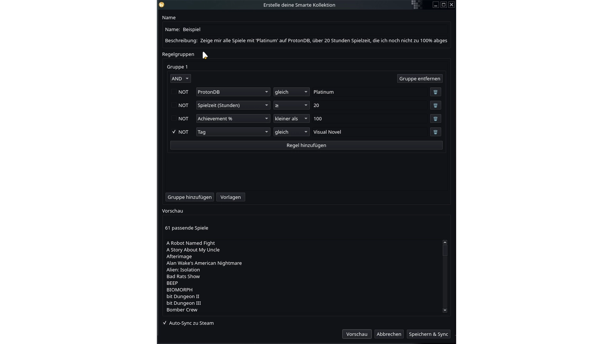
</p>

<p align="center">
  <picture>
    <source media="(prefers-color-scheme: dark)" srcset="steam_library_manager/resources/images/readme_divider_dark.webp">
    <source media="(prefers-color-scheme: light)" srcset="steam_library_manager/resources/images/readme_divider_light.webp">
    
  </picture>
</p>

<h3 align="center">💛 Unterstütze dieses Projekt</h3>

Wenn SLM dir hilft deine Bibliothek zu organisieren, denk darüber nach die Entwicklung zu unterstützen. Jeder Beitrag - egal wie klein - hilft dieses Projekt am Leben zu halten.

<p align="center">
  <a href="https://www.paypal.com/donate/?hosted_button_id=HWPG6YAGXAWJJ">
    
  </a>
  &nbsp;&nbsp;&nbsp;&nbsp;&nbsp;
  <a href="https://ko-fi.com/S6S51T9G3Y">
    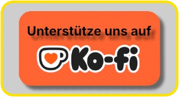
  </a>
</p>

<p align="center"><i>Danke an alle die schon etwas gegeben haben - ihr seid großartig! 🙏</i></p>

<p align="center">
  <picture>
    <source media="(prefers-color-scheme: dark)" srcset="steam_library_manager/resources/images/readme_divider_dark.webp">
    <source media="(prefers-color-scheme: light)" srcset="steam_library_manager/resources/images/readme_divider_light.webp">
    
  </picture>
</p>

<h3 align="center">🏷️ Auto-Kategorisierung - <i>17 Regeltypen, unendliche Möglichkeiten</i></h3>

Organisiere deine gesamte Bibliothek automatisch in sinnvolle Kollektionen mit **17 verschiedenen AutoCat-Regeltypen**:

**Tags** | **Genres** | **Publisher** | **Entwickler** | **Franchises** | **Flags** | **User Score** | **HowLongToBeat** | **Jahr** | **VR-Unterstützung** | **Sprache** | **Kurator** | **Plattform** | **Spielstunden** | **Deck-Status** | **Achievements** | **PEGI-Bewertung**

Jeder Regeltyp hat eigene Konfigurationsmöglichkeiten - Schwellenwerte, Ignorier-Listen, Präfix/Suffix-Muster und die Kombination mehrerer Regeln zu leistungsstarken Kategorisierungsprofilen. Intelligente Ignorier-Listen filtern generische Tags wie "Singleplayer" heraus.

*500+ Spiele? Klick auf "Auto-Kategorisieren" und schau zu wie sie sich in Sekunden in saubere, logische Kollektionen sortieren.*

<p align="center">
  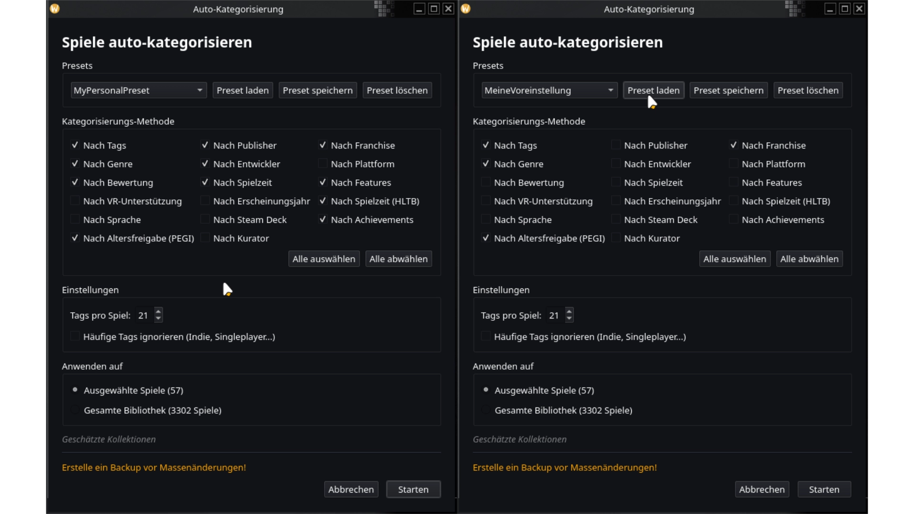
</p>
<p align="center">
  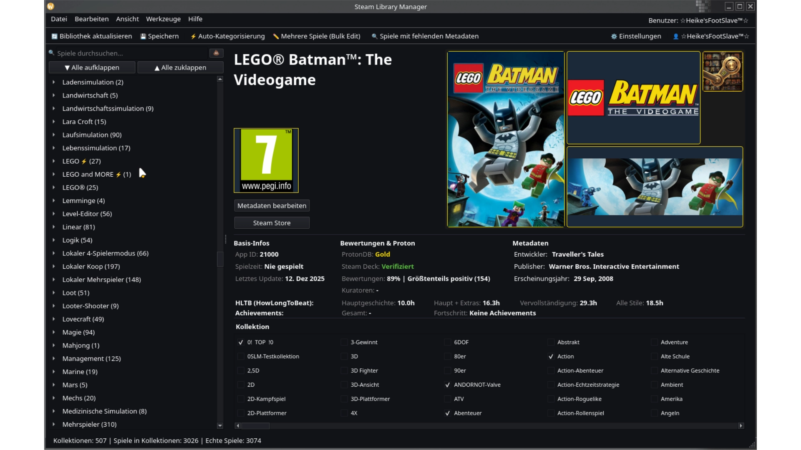
</p>

<p align="center">
  <picture>
    <source media="(prefers-color-scheme: dark)" srcset="steam_library_manager/resources/images/readme_divider_dark.webp">
    <source media="(prefers-color-scheme: light)" srcset="steam_library_manager/resources/images/readme_divider_light.webp">
    
  </picture>
</p>

<h3 align="center">✏️ Metadaten-Editor - <i>Deine Änderungen überleben Steam-Updates</i></h3>

Bearbeite Spielnamen, Sortiertitel, Entwickler, Publisher und Erscheinungsdaten - alles lokal gespeichert. Was das besonders macht:

- **Overlay-System:** Deine Änderungen werden getrennt von Steams Daten gespeichert. Wenn Steam die `appinfo.vdf` überschreibt (was regelmäßig passiert), werden deine Änderungen **automatisch erneut angewendet**. Wie Git-Rebasing für Metadaten - Steam liefert den "Upstream", deine Änderungen sind die "Patches".
- **Bulk-Edit:** Hunderte Spiele auswählen, ein Feld ändern, anwenden. Fertig.
- **Eigene Sortiertitel:** "The Witcher 3" unter "W" einsortieren statt unter "T".

*Kein anderes Steam-Library-Tool kann das. Depressurizer verliert deine Änderungen bei Steam-Updates. Wir nicht.*

<p align="center">
  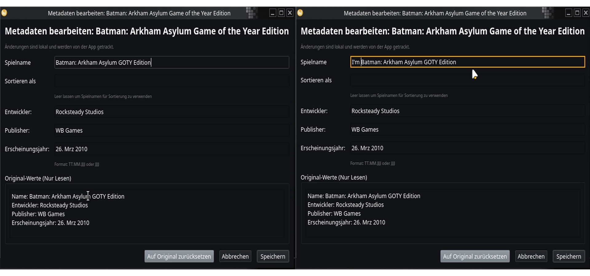
</p>
<p align="center">
  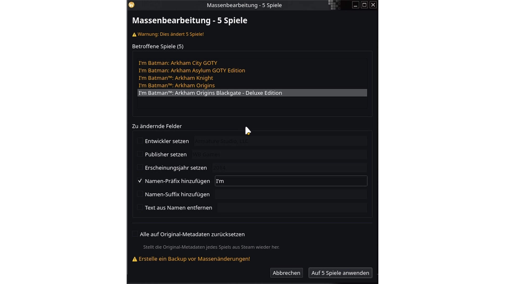
</p>

<p align="center">
  <picture>
    <source media="(prefers-color-scheme: dark)" srcset="steam_library_manager/resources/images/readme_divider_dark.webp">
    <source media="(prefers-color-scheme: light)" srcset="steam_library_manager/resources/images/readme_divider_light.webp">
    
  </picture>
</p>

<h3 align="center">🖼️ Artwork-Manager - <i>SteamGridDB auf Knopfdruck</i></h3>

Durchsuche und lade **Cover, Heroes, Logos und Icons** von [SteamGridDB](https://www.steamgriddb.com/) herunter - der größten Community-getriebenen Spiele-Artwork-Datenbank.

- **Visueller Browser** mit Vorschaubildern - sieh was du auswählst bevor du es anwendest
- **Filtere nach Typ:** statisch, animiert (GIF/APNG/WebM), NSFW, Humor, Epilepsie-Warnung
- **Badge-System** mit animierten Slide-Down-Indikatoren - farbige Streifen zeigen Inhalts-Tags auf einen Blick
- **Ein Klick zum Anwenden** - Artwork wird heruntergeladen und sofort als Cover gesetzt

<p align="center">
  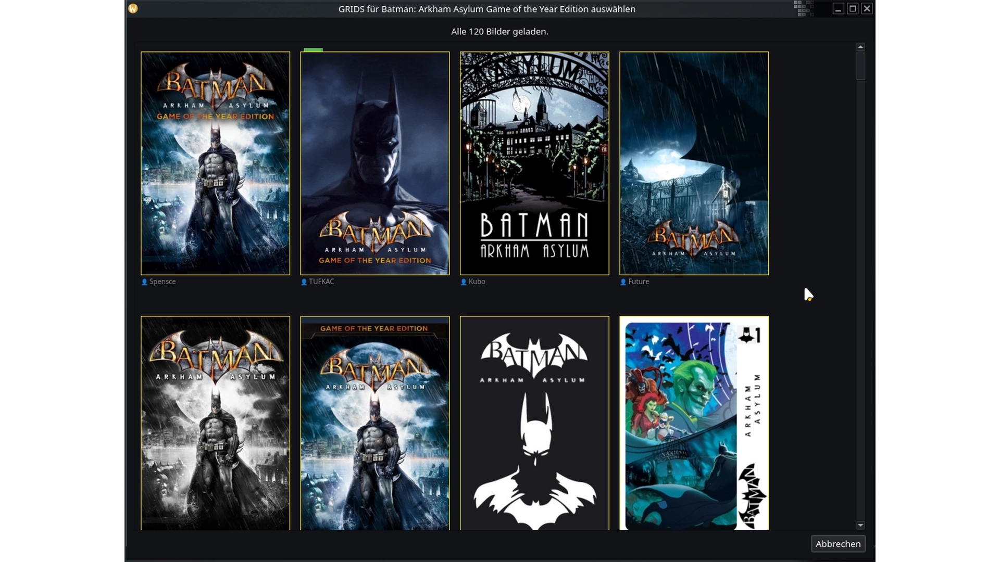
</p>
<p align="center">
  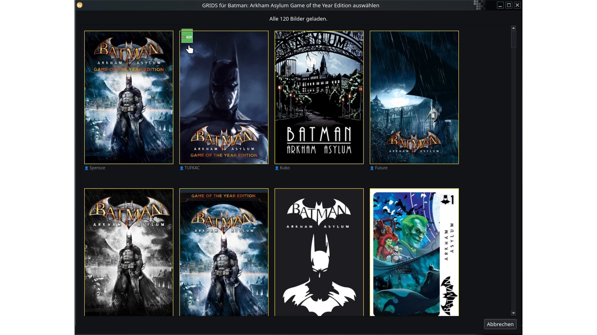
</p>

<p align="center">
  <picture>
    <source media="(prefers-color-scheme: dark)" srcset="steam_library_manager/resources/images/readme_divider_dark.webp">
    <source media="(prefers-color-scheme: light)" srcset="steam_library_manager/resources/images/readme_divider_light.webp">
    
  </picture>
</p>

<h3 align="center">📊 Daten-Anreicherung - <i>Wisse alles über deine Spiele</i></h3>

Reichere deine gesamte Bibliothek im Batch mit Daten aus mehreren Quellen an - alles lokal in SQLite gecacht für sofortigen Zugriff:

| Quelle | Daten | API-Key nötig? |
|--------|-------|:-:|
| **HowLongToBeat** | Hauptstory, Komplett, alle Spielstile | Nein |
| **ProtonDB** | Linux-Kompatibilität (Platinum/Gold/Silver/Bronze/Borked) | Nein |
| **Steam Achievements** | Abschlussquote pro Spiel | Nein (mit OAuth2) |
| **Steam Tags** | Community-Tags direkt aus Steam importiert | Nein (mit OAuth2) |
| **Steam Store** | Beschreibungen, DLC-Info, Altersfreigaben | Nein |

*Klick auf "Alle anreichern" und hol dir einen Kaffee. Wenn du zurückkommst hat jedes Spiel vollständige Metadaten.*

<p align="center">
  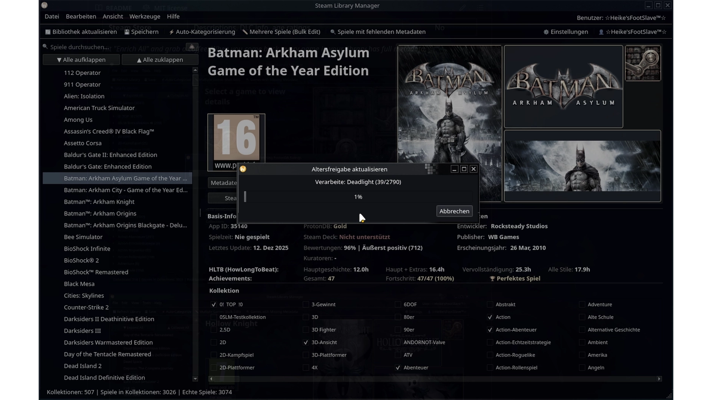
</p>
<p align="center">
  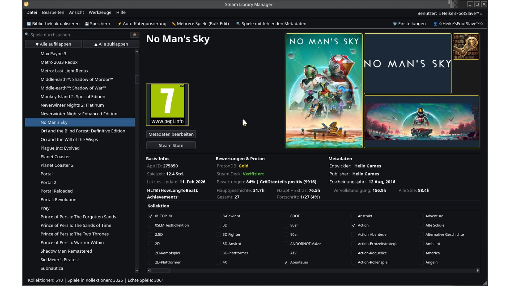
</p>

<p align="center">
  <picture>
    <source media="(prefers-color-scheme: dark)" srcset="steam_library_manager/resources/images/readme_divider_dark.webp">
    <source media="(prefers-color-scheme: light)" srcset="steam_library_manager/resources/images/readme_divider_light.webp">
    
  </picture>
</p>

<h3 align="center">🔒 Sicherheit - <i>Kein Copy-Paste, kein Klartext</i></h3>

- **QR-Code-Login** oder Passwort-Login über Steams offizielles **OAuth2** (`IAuthenticationService`)
- Tokens **verschlüsselt** (AES-GCM) mit maschinengebundenen Schlüsseln oder im **System-Keyring** gespeichert
- Automatische **Token-Erneuerung** - kein erneutes Anmelden bei jedem App-Start
- Der **Steam Web API Key** ist dank OAuth2 **optional** - wird aber für volle Funktionalität **dringend empfohlen**. Konfiguration direkt in der App unter Einstellungen.

*Keine dubiosen Browser-Session-Tokens. Keine API-Keys in Klartext-Konfigdateien. Einfach scannen, einloggen, fertig.*

<p align="center">
  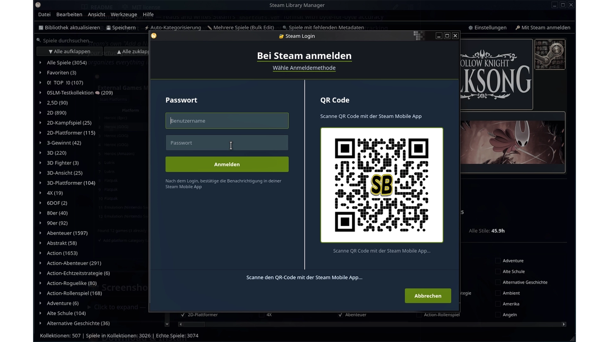
</p>

<p align="center">
  <picture>
    <source media="(prefers-color-scheme: dark)" srcset="steam_library_manager/resources/images/readme_divider_dark.webp">
    <source media="(prefers-color-scheme: light)" srcset="steam_library_manager/resources/images/readme_divider_light.webp">
    
  </picture>
</p>

<h3 align="center">🌍 Mehrsprachig - <i>Deine Sprache, dein Weg</i></h3>

Vollständige **Englisch 🇬🇧** und **Deutsch 🇩🇪** Oberfläche mit **kompletter i18n** - null hardcodierte Strings im gesamten Code.

- **Getrennte Einstellungen** für UI-Sprache und Tag-Sprache - englische Oberfläche mit deutschen Steam-Kategorien, oder jede beliebige Kombination
- **Lokalisierte Datumsformate** - "07. Dez 2024" auf Deutsch, "07 Dec 2024" auf Englisch
- **Community-Übersetzungen willkommen** - Beitragen ist einfach, keine Programmierkenntnisse nötig ([siehe unten](#-übersetzungen))

<p align="center">
  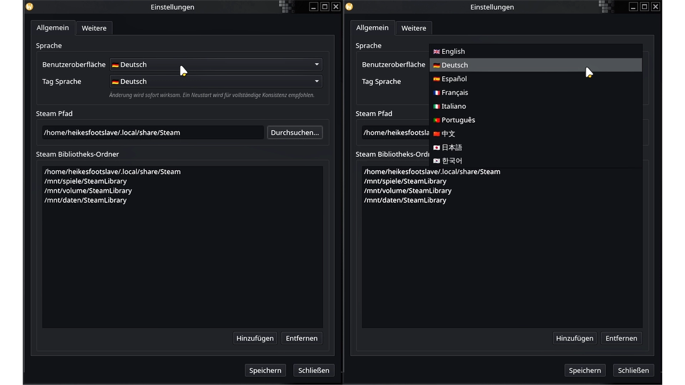
</p>

<p align="center">
  <picture>
    <source media="(prefers-color-scheme: dark)" srcset="steam_library_manager/resources/images/readme_divider_dark.webp">
    <source media="(prefers-color-scheme: light)" srcset="steam_library_manager/resources/images/readme_divider_light.webp">
    
  </picture>
</p>

<h3 align="center">🐧 Linux Native - <i>Hier gebaut, für hier gemacht</i></h3>

Entwickelt mit **PyQt6** für nahtlose Desktop-Integration. Das ist keine Windows-App mit angeschraubtem Linux-Port - es ist **auf Linux gebaut, für Linux**, von Tag eins an.

- **Steam Deck kompatibel** - funktioniert im Desktop-Modus
- **Wayland & X11** unterstützt
- **AppImage, Flatpak, AUR, .deb, .rpm & tar.gz** Pakete verfügbar
- Windows-Unterstützung ist geplant - aber Linux hat immer Vorrang

<p align="center">
  <picture>
    <source media="(prefers-color-scheme: dark)" srcset="steam_library_manager/resources/images/readme_divider_dark.webp">
    <source media="(prefers-color-scheme: light)" srcset="steam_library_manager/resources/images/readme_divider_light.webp">
    
  </picture>
</p>

<h3 align="center">🎮 Externe Spiele - <i>Eine Bibliothek für alles</i></h3>

Spiele verstreut über Epic, GOG, Amazon, Lutris, Bottles, itch.io und Flatpak? **SLM findet sie alle** - und fügt sie in einem Rutsch als Non-Steam-Shortcuts zu Steam hinzu.

- **8 Plattform-Parser** - Heroic (Epic/GOG/Amazon), Lutris, Bottles, itch.io, Flatpak und bestehende shortcuts.vdf
- **Auto-Erkennung** - SLM scannt nach installierten Launchern (nativ und Flatpak) und liest deren Spielebibliotheken direkt aus. Steams "Steam fremdes Spiel hinzufügen"-Dialog sieht nur Programme in deinem PATH - er hat keine Ahnung was Heroic, Lutris oder Bottles installiert haben
- **Duplikat-Schutz** - bereits in Steam vorhandene Spiele werden erkannt und übersprungen
- **Plattform-Kollektionen** - importierte Spiele werden automatisch nach Plattform in Steam-Kollektionen einsortiert. In SLMs Seitenleiste bekommt jede Kollektion einen visuellen Emoji-Indikator zur sofortigen Erkennung:

| Kollektion | Indikator |
|---|---|
| Epic Games 🟦 | Blau (Epic-Markenfarbe) |
| GOG Galaxy 🟣 | Lila (GOG-Markenfarbe) |
| Amazon Games 🟠 | Orange (Amazon-Markenfarbe) |
| Lutris 🎮 | Controller |
| Bottles 🍾 | Flasche |
| itch.io 🎲 | Würfel |
| Flatpak 📦 | Paket |

- **Binärer VDF-Parser** - liest und schreibt Steams `shortcuts.vdf`-Format mit Byte-genauer Präzision
- **Batch-Import** - alle Plattformen auf einmal scannen, auswählen, alle mit Fortschrittsanzeige hinzufügen

*Steams eigener "Steam fremdes Spiel hinzufügen"-Dialog kann zwar mehrere Apps markieren - aber er sieht nur was in deinem PATH liegt, nicht deine tatsächlichen Spielebibliotheken. SLM scannt Heroic, Lutris, Bottles und mehr direkt, weiß genau was installiert ist, und organisiert alles automatisch in saubere Kollektionen.*

<p align="center">
  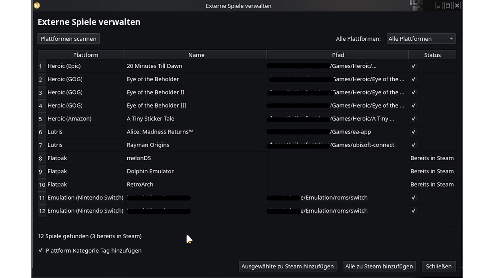
</p>

<p align="center">
  <picture>
    <source media="(prefers-color-scheme: dark)" srcset="steam_library_manager/resources/images/readme_divider_dark.webp">
    <source media="(prefers-color-scheme: light)" srcset="steam_library_manager/resources/images/readme_divider_light.webp">
    
  </picture>
</p>

<h3 align="center">🔄 Integrierte Auto-Updates - <i>Immer aktuell, null Aufwand</i></h3>

AppImage-Nutzer bekommen nahtlose In-App-Updates - kein manuelles Herunterladen, keine Terminal-Befehle. SLM prüft GitHub Releases automatisch (konfigurierbar: täglich, wöchentlich, monatlich oder nie), zeigt vollständige Versionshinweise mit Changelog, lädt im Hintergrund mit Fortschrittsanzeige herunter und startet mit einem Klick in die neue Version neu. Falls etwas schiefgeht, wird die vorherige Version automatisch wiederhergestellt.

- **Atomarer Austausch** mit Rollback - ein Update kann nie eine kaputte Installation hinterlassen
- **"Version überspringen"**-Button - ungewünschte Updates wegklicken ohne genervt zu werden
- **Konfigurierbar** - Prüfintervall in den Einstellungen festlegen, oder jederzeit manuell prüfen

*AUR- und Flatpak-Nutzer aktualisieren wie gewohnt über ihren Paketmanager.*

<p align="center">
  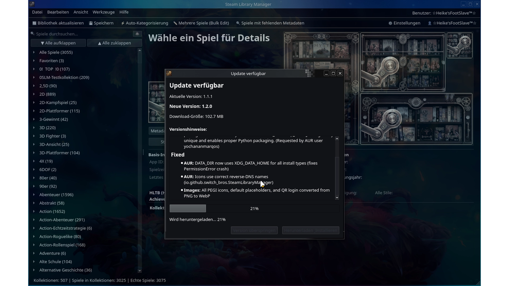
</p>


<h2 align="center">📸 Weitere Screenshots</h2>

<details>
<summary>Klicken zum Aufklappen - Zusätzliche Ansichten</summary>

| Screenshot | Beschreibung |
|-----------|-------------|
|  | Rechtsklick-Kontextmenü - Schnellzugriff auf alle Aktionen |
| 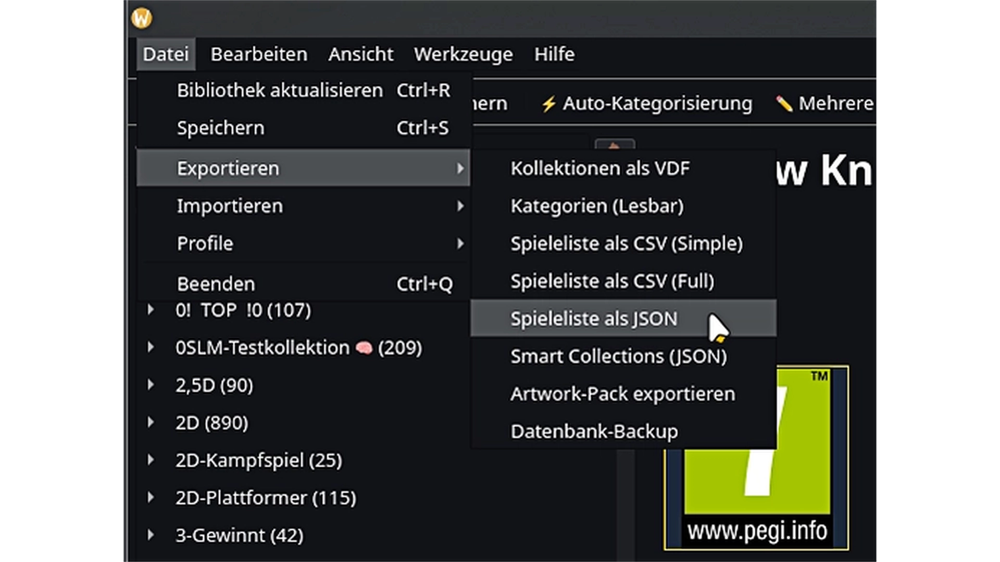 | Export-Dialog - CSV, JSON, VDF, Datenbank-Backup |
| 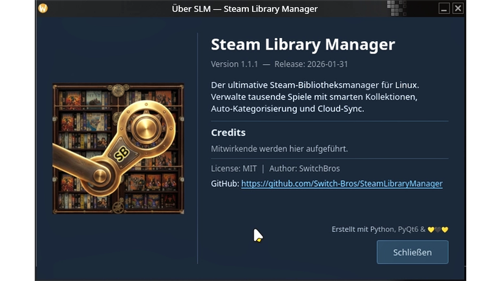 | Über-Dialog mit Versions- & Systeminfo |

</details>


<h2 align="center">📦 Download & Installation</h2>

| Format | Download | Hinweise |
|--------|----------|----------|
| 🐧 **AppImage** | [Neueste Version](https://github.com/Switch-Bros/SteamLibraryManager/releases) | Funktioniert auf jeder Distro - herunterladen, chmod +x, starten |
| 📦 **Flatpak** | *Flathub-Review ausstehend* | Sandboxed, Auto-Updates |
| 🏗️ **AUR** | `yay -S steam-library-manager` | Arch / Manjaro / CachyOS / EndeavourOS |
| 🎩 **.rpm** | [Neueste Version](https://github.com/Switch-Bros/SteamLibraryManager/releases) | Fedora / openSUSE |
| 🍥 **.deb** | [Neueste Version](https://github.com/Switch-Bros/SteamLibraryManager/releases) | Debian / Ubuntu / Linux Mint |
| 📁 **tar.gz** | [Neueste Version](https://github.com/Switch-Bros/SteamLibraryManager/releases) | Portabel mit Install-Skript |

<p align="center"><b>Läuft hervorragend auf dem Steam Deck</b> - getestet auf LCD und OLED.<br>Die Oberfläche passt sich automatisch an kleinere Displays an.</p>

<p align="center">
  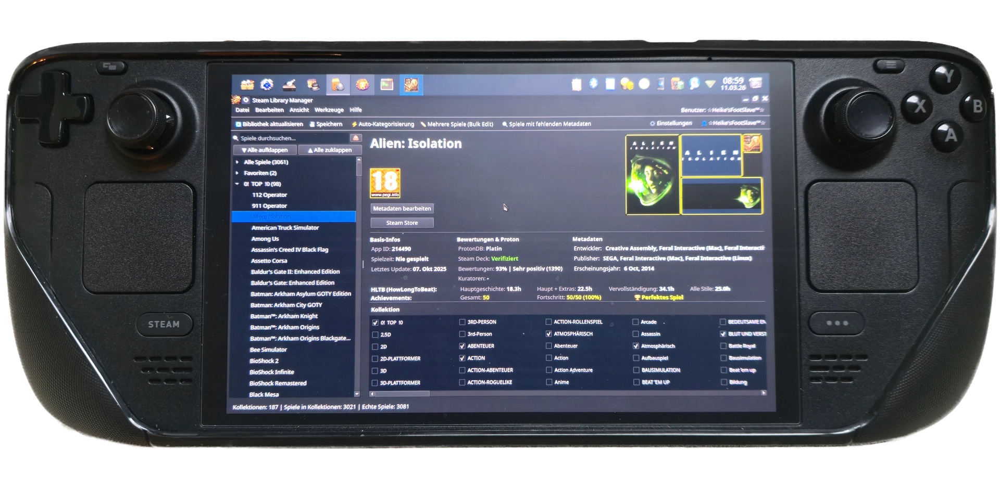
</p>

<details>
<summary>🔧 Aus Quellcode bauen (für Entwickler)</summary>

```bash
# Klonen
git clone https://github.com/Switch-Bros/SteamLibraryManager.git
cd SteamLibraryManager

# Virtuelle Umgebung
python3 -m venv .venv
source .venv/bin/activate

# Abhängigkeiten
pip install -r requirements.txt

# Starten
python steam_library_manager/main.py
```

Benötigt **Python 3.10+** und einen laufenden **Steam Client** (nicht Big Picture).

</details>

<p align="center">
  <picture>
    <source media="(prefers-color-scheme: dark)" srcset="steam_library_manager/resources/images/readme_divider_dark.webp">
    <source media="(prefers-color-scheme: light)" srcset="steam_library_manager/resources/images/readme_divider_light.webp">
    
  </picture>
</p>

<details>
<summary><h2>🔧 API- & Authentifizierungs-Anforderungen</h2></summary>

Dieses Projekt nutzt folgende Dienste:

<h3 align="center">1. Steam-Authentifizierung (OAuth2)</h3>
- **Zweck:** Anmeldung mit deinem Steam-Konto für Zugriff auf deine Bibliothek und Anzeige deines Profilnamens.
- **Funktionsweise:**
 - Nutzt Steams offizielles **OAuth2** über `IAuthenticationService` (QR-Code oder Passwort-Login).
 - Tokens werden **verschlüsselt** (AES-GCM) oder im System-Keyring gespeichert.
 - Der **Steam Web API Key** ist dank OAuth2 **optional** - wird aber für volle Funktionalität **dringend empfohlen** (Metadaten-Anreicherung, Achievement-Sync etc.).
 - Du kannst deinen API-Key direkt in der App unter **Einstellungen -> Steam Web API Key** eintragen.
 - Key hier beantragen: [Steam Web API Key](https://steamcommunity.com/dev/apikey)

<h3 align="center">2. SteamGridDB</h3>
- **Erforderlich für:** Anpassung von Spiel-Covern, Heroes, Logos und Icons.
- **So erhältst du den API-Schlüssel:**
 - Die App **fragt automatisch** nach dem SteamGridDB-API-Schlüssel, sobald du zum ersten Mal auf ein Spiel-Cover klickst.
 - Es öffnet sich ein Fenster, in dem du:
    1. **Deinen API-Schlüssel** von [SteamGridDB](https://www.steamgriddb.com/api) holst.
    2. **Den Schlüssel** in das Eingabefeld der App einfügst.
    3. Auf **OK** klickst - der Schlüssel wird lokal gespeichert, und die Cover-Funktionen sind sofort nutzbar!
 - **Hinweis:** Nutzer müssen die [Nutzungsbedingungen von SteamGridDB](https://www.steamgriddb.com/terms) einhalten.

<h3 align="center">3. HowLongToBeat (HLTB)</h3>
- **Enthalten für:** Anzeige von Spielzeiten und Auto-Kategorisierung nach Spielzeitbereichen.
- **Kein API-Key nötig.** Daten werden automatisch abgerufen und lokal gecacht.
- **Hinweis:** HLTB bietet keine offizielle öffentliche API an. Die Integration respektiert deren [Nutzungsbedingungen](https://howlongtobeat.com/).

<h3 align="center">4. ProtonDB</h3>
- **Enthalten für:** Linux/Proton-Kompatibilitätsbewertungen.
- **Kein API-Key nötig.** Lesender Zugriff, lokal gecacht mit 7-Tage TTL.

</details>


<h2 align="center">🗺️ Roadmap</h2>

| Meilenstein | Status |
|-------------|--------|
| Core-Engine, Datenbank, Cloud Sync, Auth | ✅ Fertig |
| Architektur-Refactoring, Menü-Redesign | ✅ Fertig |
| Depressurizer Feature-Parität (17 AutoCat-Typen) | ✅ Fertig |
| Smart Collections, Steam Deck Optimizer, HLTB | ✅ Fertig |
| Externe Spiele (8 Parser), ProtonDB, Kuratoren | ✅ Fertig |
| UI-Polish, Keyboard Shortcuts, Dokumentation | ✅ Fertig |
| **v1.1.1 - Erste öffentliche Veröffentlichung** | ✅ **Veröffentlicht** |
| **v1.2.0 - Modul-Umbenennung, AUR-Paket** | ✅ **Veröffentlicht** |
| Steam Deck responsive UI | ✅ Fertig |
| Library Auto-Sync | ✅ Fertig |
| Multi-Format Packaging (.deb, .rpm, tar.gz) | ✅ Fertig |
| **v1.2.4 - Steam Deck + Packaging Release** | ✅ **Veröffentlicht** |
| **v1.2.5 - AppImage-Update Fix** | ✅ **Veröffentlicht** |
| **v1.2.6 - Dock-Integration Fix** | ✅ **Veröffentlicht** |
| Packaging (AppImage, AUR, Flatpak) | 🔄 Flatpak-Review ausstehend |
| Windows-Unterstützung | 📋 Geplant |


<h2 align="center">🌍 Übersetzungen</h2>

Steam Library Manager kommt mit **Englisch** und **Deutsch**. Du willst es in deiner Sprache sehen?

**Eine Übersetzung beizutragen ist einfach - keine Programmierkenntnisse nötig!**

1. Kopiere eine beliebige JSON-Datei aus `steam_library_manager/resources/i18n/en/` als Vorlage
2. Übersetze die Werte (niemals die Keys ändern!)
3. Platzhalter wie `{count}` und `{name}` unverändert lassen
4. Deine Sprache in `steam_library_manager/resources/i18n/languages.json` eintragen:
   ```json
   "tr": "🇹🇷  Türkçe"
   ```
5. Pull Request erstellen

Der Sprachname muss immer in der **eigenen Originalschrift** stehen - "Türkçe", nicht "Turkish".


<h2 align="center">🛡️ Datenschutz & Sicherheit</h2>

- **Keine Telemetrie.** Steam Library Manager telefoniert nicht nach Hause.
- **Keine Datenerfassung.** Deine Bibliothek, deine Daten, dein Rechner.
- **Token-Verschlüsselung.** Steam-Zugangsdaten mit AES-GCM verschlüsselt oder im System-Keyring.
- **API-Keys lokal gespeichert.** Werden niemals an Dritte übermittelt.
- **Automatische Backups.** Vor jedem Schreibvorgang auf Steam-Dateien wird ein Backup erstellt.


<h2 align="center">🤝 Mitmachen</h2>

- 🐛 **Bug gefunden?** -> [Issue erstellen](https://github.com/Switch-Bros/SteamLibraryManager/issues)
- 💡 **Idee?** -> [Diskussion starten](https://github.com/Switch-Bros/SteamLibraryManager/discussions)
- 🌍 **Sprichst du eine andere Sprache?** -> [Hilf beim Übersetzen!](#-übersetzungen)
- 🔧 **Willst du coden?** -> Fork das Repo, schau dir die Issues an und erstelle einen PR


<h2 align="center">🙏 Danksagungen</h2>

- [SteamGridDB](https://www.steamgriddb.com/) - Spiel-Artwork
- [HowLongToBeat](https://howlongtobeat.com/) - Spielzeit-Daten
- [ProtonDB](https://www.protondb.com/) - Linux-Kompatibilitätsbewertungen
- [SteamKit2](https://github.com/SteamRE/SteamKit) / [ValvePython/steam](https://github.com/solsticegamestudios/steam) - Steam-Protokoll-Forschung
- [steamapi.xpaw.me](https://steamapi.xpaw.me/) - Steam Web API Dokumentation


<h2 align="center">⚖️ Rechtlicher Hinweis</h2>

Diese Software wird **"WIE SIE IST"** bereitgestellt, ohne jegliche ausdrückliche oder stillschweigende Gewährleistung, einschließlich, aber nicht beschränkt auf die Gewährleistung der Marktgängigkeit, der Eignung für einen bestimmten Zweck und der Nichtverletzung von Rechten Dritter.

In keinem Fall haften die Autoren oder Urheberrechtsinhaber für Ansprüche, Schäden oder sonstige Haftung, ob aus Vertrag, unerlaubter Handlung oder anderweitig, die sich aus der Software oder der Nutzung der Software oder dem sonstigen Umgang mit der Software ergeben.

- Du **musst** die Nutzungsbedingungen der jeweiligen API-Anbieter (Steam, SteamGridDB, HLTB, ProtonDB) einhalten.
- Der Entwickler (**Switch Bros**) übernimmt **keine Verantwortung** für den Missbrauch von API-Schlüsseln oder Verstöße gegen die Nutzungsbedingungen Dritter.
- API-Schlüssel werden **lokal gespeichert** und **niemals** an Dritte übermittelt.
- Steam Library Manager ist **nicht verbunden mit, unterstützt von oder assoziiert mit Valve Corporation** oder einem anderen Drittanbieter-Dienst.


<h2 align="center">📜 Lizenz</h2>

[MIT License](LICENSE) - Copyright © 2026 Switch Bros.

<p align="center">
  <picture>
    <source media="(prefers-color-scheme: dark)" srcset="steam_library_manager/resources/images/readme_footer_dark.webp">
    <source media="(prefers-color-scheme: light)" srcset="steam_library_manager/resources/images/readme_footer_light.webp">
    
  </picture>
</p>

<p align="center">
  Mit ❤️ auf Linux gebaut von <a href="https://github.com/Switch-Bros">Switch Bros</a>
</p>
